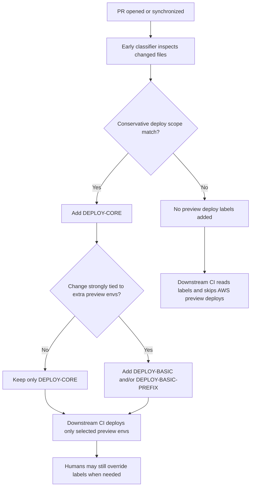

# Preview Deploy Auto-Labeling

## Problem Frame

This repository currently deploys preview AWS environments for pull requests even when the changed files could not affect code running in AWS. A PR that only adds or updates non-runtime files can still trigger a full preview deployment, which wastes time and infrastructure effort.

The maintainers want preview deployment to become an explicit decision driven by early PR scope classification rather than implicit job execution. The system should default to **no AWS preview deployment** unless the PR is labeled for preview deployment. Automation should conservatively add deploy labels for likely runtime, infrastructure, or workflow-affecting changes, while still allowing humans to override the decision when needed.

## User Flow

## Requirements

**Default Behavior**
- R1. Pull requests must default to no AWS preview deployment unless deploy labels are present.
- R2. Preview deployment eligibility must be determined early in the workflow rather than inferred later from scattered job-level conditions.
- R3. Downstream deploy jobs must key off labels as the control plane for whether preview environments are deployed.

**Classifier Behavior**
- R4. An early automation step must inspect PR file scope and conservatively add deploy labels for changes that may reasonably require AWS preview deployment.
- R5. Conservative matches must include workflow and deployment-related paths such as `.github/workflows/**`, `.github/actions/**`, deploy scripts, `cdk/**`, `packages/cdk/**`, and `packages/microapps-cdk/**`.
- R6. The classifier must be additive only: it may add labels but must not automatically remove deploy labels after later pushes.
- R7. The classifier must operate for pull requests targeting this repository, including PRs whose head branch lives in a fork.

**Label Model**
- R8. `DEPLOY-CORE` must be the primary gate label for the main preview deployment.
- R9. Existing labels such as `DEPLOY-BASIC` and `DEPLOY-BASIC-PREFIX` must remain in use rather than being replaced in this phase.
- R10. The classifier must add `DEPLOY-CORE` for conservative matches by default.
- R11. The classifier must only add `DEPLOY-BASIC` and `DEPLOY-BASIC-PREFIX` when file scope strongly suggests those extra preview environments are warranted.

**Human Override and Operability**
- R12. Humans must be able to override the classifier by manually adding deploy labels when a deploy is desirable despite narrow file scope.
- R13. Humans must be able to leave auto-added labels in place without the automation later fighting them.
- R14. The resulting behavior must be easy to inspect from the PR UI so reviewers can understand why deployment did or did not run.

## Success Criteria
- A PR that only changes obviously non-runtime files does not deploy a preview AWS environment by default.
- A PR touching runtime, infra, workflow, or deploy-related files gets `DEPLOY-CORE` automatically.
- Extra preview environments are not deployed unless their specific labels are present.
- A maintainer can still force a preview deploy by adding labels manually.
- The deploy decision is understandable from the PR labels without reading workflow internals.

## Scope Boundaries
- This work changes the decision model for preview deployment on PRs; it does not redesign the entire release or main-branch deployment pipeline.
- This work does not require replacing the current deploy labels with a brand-new taxonomy.
- This work does not require the classifier to support autonomous label removal.
- This work does not require isolated fork repositories to inherit or run the same automation independently.

## Key Decisions
- Default to no preview deploy: preview AWS environments should be opt-in through labels, with automation supplying the common case.
- Use labels as the deploy control plane: labels are easier to inspect and override than pure file filters.
- Be conservative in auto-labeling: it is better to occasionally over-label for deploy than to silently skip a deploy that should have happened.
- Keep the classifier additive only: automatic removal would create churn and make human overrides less trustworthy.
- Introduce `DEPLOY-CORE` as the main preview gate while preserving `DEPLOY-BASIC` and `DEPLOY-BASIC-PREFIX` for extra environment selection.

## Dependencies / Assumptions
- The current CI workflow already reads deploy-related labels and can be adapted to treat label presence as the primary gate.
- The repository can run an early PR-scoped job with permission to apply labels to pull requests in this repo.
- Existing deploy jobs can be restructured to respect label-driven gating without changing the underlying deploy mechanics.

## Outstanding Questions

### Deferred to Planning
- [Affects R4][Technical] Should the classifier use a GitHub Action such as `actions/github-script`, a reusable action, or a small checked-in script?
- [Affects R7][Technical] Which workflow trigger and permission model best supports labeling PRs from fork branches targeting this repository without widening risk unnecessarily?
- [Affects R11][Technical] Which exact path groups should map to `DEPLOY-BASIC` and `DEPLOY-BASIC-PREFIX` versus only `DEPLOY-CORE`?
- [Affects R14][Technical] Should the workflow also emit a PR comment or job summary explaining the auto-label decision, or are labels alone sufficient?

## Next Steps
-> /prompts:ce-plan for structured implementation planning
