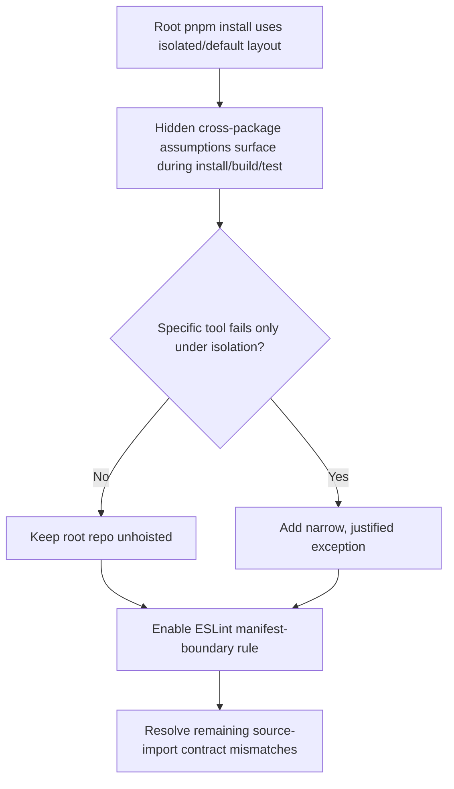
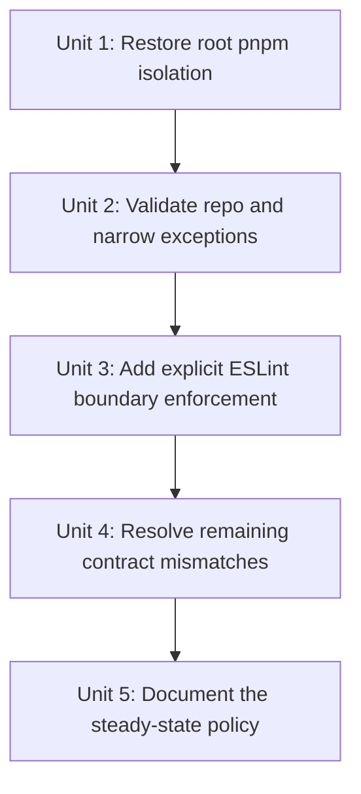

# refactor: enforce monorepo import boundaries under pnpm isolation

## Overview

Update the import-boundary plan to reflect the repo's current state after the pnpm migration. The repo now already uses pnpm and mostly explicit `workspace:*` declarations, but the root `.npmrc` forces `node-linker=hoisted`, which recreates a flat `node_modules` layout and weakens the install-time isolation the migration was supposed to give us. The revised plan makes pnpm's isolated layout the first boundary guardrail, then layers repo-wide ESLint dependency enforcement on top for clearer contributor feedback.

## Problem Frame

The origin requirements document established that package boundaries in this monorepo were not being enforced reliably and that contributors could import workspace packages without declaring them (see origin: `docs/brainstorms/2026-04-04-monorepo-import-boundary-enforcement-requirements.md`). Since that brainstorm, the repo has already merged a pnpm migration and explicit `workspace:*` dependency declarations for several packages, so the problem has shifted.

The main remaining gap is that the root repo currently sets `node-linker=hoisted` in `.npmrc`. pnpm's own default is `isolated`, and pnpm documents `hoisted` as the flat `node_modules` mode comparable to npm or Yarn Classic. That means the repo is now on pnpm in name, but not yet using pnpm's normal installation isolation as an actual architecture guardrail. At the same time, the root ESLint config still does not enforce `import/no-extraneous-dependencies`, so there is no explicit policy layer with good diagnostics.

This update keeps the original product intent intact: legitimate internal dependencies should be explicit, invalid ones should fail predictably, and the repo should be a credible example of monorepo boundary enforcement. The change is in sequencing: restore pnpm isolation first, then add lint-based manifest enforcement, then resolve any remaining contract mismatches that become visible.

## Requirements Trace

- R1. Use package manifests as the primary contract for whether one package may import another.
- R2. Make undeclared imports fail in normal contributor workflows, using both install-time isolation and lint-time diagnostics where each is strongest.
- R3. Keep TypeScript project references informational rather than treating them as the boundary mechanism.
- R4. Run the effective enforcement path in local development and CI.
- R5. Preserve actionable feedback for contributors, especially once pnpm isolation surfaces hidden assumptions.
- R6. Allow legitimate internal dependencies to remain explicit instead of relying on accidental hoisting.
- R7. Align the repo's actual pnpm configuration with the intended post-migration boundary model instead of preserving a Yarn-Classic-like flat install.

## Scope Boundaries

- This plan does not redo the already-merged pnpm migration.
- This plan does not introduce a full architecture-direction graph in phase 1; it still focuses on “must be declared” before “may depend on.”
- This plan does not require `packages/microapps-cdk` to stop being a projen-managed standalone island.
- This plan does not assume that zero hoisting is possible forever; it requires that any surviving hoist behavior be narrow, justified, and no longer repo-wide by default.

## Context & Research

### Relevant Code and Patterns

- The root repo is now pinned to `pnpm@10.29.3` via `package.json` and uses pnpm-rooted scripts such as `pnpm build`, `pnpm lint`, and `pnpm test`.
- The root `.npmrc` currently contains only `node-linker=hoisted`, which makes the entire repo install in pnpm's flat hoisted mode.
- Root workflows and the reusable setup action are already pnpm-aware:
  - `.github/actions/configure-nodejs/action.yml`
  - `.github/workflows/ci.yml`
  - `.github/workflows/main-build.yml`
  - `.github/workflows/release.yml`
- Several internal dependency declarations that were previously missing are now present:
  - `packages/microapps-router/package.json` declares `@pwrdrvr/microapps-datalib` and `@pwrdrvr/microapps-router-lib` as `workspace:*`
  - `packages/microapps-deployer/package.json` declares `@pwrdrvr/microapps-datalib` and `@pwrdrvr/microapps-deployer-lib` as `workspace:*`
  - `packages/pwrdrvr/package.json` declares `@pwrdrvr/microapps-deployer-lib` as `workspace:*` in `devDependencies`
- The root ESLint config still does not enable `import/no-extraneous-dependencies`, so there is currently no explicit repo-wide lint rule for source-import legality.
- `packages/microapps-cdk` is still a special standalone pnpm island:
  - `packages/microapps-cdk/.projenrc.js` is the source of truth
  - `packages/microapps-cdk/.npmrc` contains only `resolution-mode=highest`
  - `packages/microapps-cdk/AGENTS.md` documents standalone `pnpm install --ignore-workspace` flows
- Existing package-manager verification seams already exist and should be reused rather than reinvented:
  - `tests/package-manager/pnpm-workspace-smoke.spec.ts`
  - `tests/package-manager/resolve-manager.spec.ts`
  - `packages/microapps-cdk/test/PackageManager.spec.ts`
  - `scripts/package-manager/check-tarball-population.mjs`
- The merged pnpm migration plan already stated the right long-term posture: add only the minimum pnpm hoist settings proven necessary after observed failures. The current root `.npmrc` does not yet reflect that posture.

### Institutional Learnings

- No `docs/solutions/` knowledge base exists in this repository, so there are no prior solution docs to carry forward.
- The completed pnpm migration plan in `docs/plans/2026-04-04-001-refactor-pnpm-workspace-ci-plan.md` is relevant prior art and should be treated as part of the planning context for this update.

### External References

- pnpm settings docs: `nodeLinker` defaults to `isolated`, while `hoisted` creates a flat `node_modules`; `hoistPattern` is the recommended narrower escape hatch and `publicHoistPattern` exposes phantom deps to application code: [pnpm settings](https://pnpm.io/settings)
- pnpm workspace docs for ongoing use of explicit local workspace references: [pnpm workspace docs](https://pnpm.io/workspaces)
- `eslint-plugin-import` rule docs for `no-extraneous-dependencies`, especially monorepo-oriented `packageDir` configuration: [import-js/eslint-plugin-import](https://github.com/import-js/eslint-plugin-import/blob/main/docs/rules/no-extraneous-dependencies.md)

## Key Technical Decisions

- Make pnpm's isolated layout the first boundary guardrail by removing the repo-wide `node-linker=hoisted` override.
  - Rationale: the repo has already paid the migration cost to pnpm, and pnpm's default isolated layout is now the most direct way to stop re-creating Yarn-Classic-like dependency visibility across the whole tree.
- Treat repo-wide hoisting as a migration crutch, not a steady-state design.
  - Rationale: pnpm explicitly documents `hoisted` as the flat layout and recommends narrowing hoisting to proven-problem packages when needed. The current root setting is broader than the plan intended.
- Prefer the narrowest possible exception when isolated installs expose a real tool problem.
  - Rationale: if something genuinely fails under isolated layout, the fallback should be `hoistPattern` before `publicHoistPattern`, and package-local or island-specific accommodation before a repo-wide compromise.
- Keep repo-wide ESLint dependency enforcement as a second guardrail even after pnpm isolation is restored.
  - Rationale: pnpm isolation helps at install/runtime resolution time, but ESLint gives much better file-level diagnostics in editors and CI, and it catches issues that are semantically wrong even when install layout happens to work.
- Re-evaluate `pwrdrvr`'s dependency on `@pwrdrvr/microapps-deployer-lib` under the new posture rather than assuming the merged `workspace:*` declaration fully solved it.
  - Rationale: the dependency is now declared, but it still lives in `devDependencies` for a published package and points at a private workspace library. Hoisting should not remain in place to mask any lingering contract mismatch there.
- Keep `packages/microapps-cdk` as the most likely exception candidate, but validate it under its existing standalone pnpm flow before conceding any root-level hoist behavior.
  - Rationale: the repo already treats that package as a special projen-managed island, so if anything truly needs accommodation, that is where it is most likely to belong.

## Open Questions

### Resolved During Planning

- Should the root repo remain on `node-linker=hoisted` now that pnpm is already merged?
  - Resolution: no. The root should use pnpm's isolated/default layout, and any remaining hoist behavior must be justified by an observed failure rather than kept as the default.
- Does restoring pnpm isolation eliminate the need for ESLint boundary enforcement?
  - Resolution: no. Isolation is the install-time guardrail; lint remains the explicit policy and diagnostics layer.
- Where should hoist exceptions live if isolated installs break a specific workflow?
  - Resolution: use the narrowest viable exception, preferring hidden hoists (`hoistPattern`) over root-visible phantom dependency exposure (`publicHoistPattern`), and preferring package-local/island-specific handling over repo-wide hoisting.

### Deferred to Implementation

- Which concrete workflows, if any, fail under isolated layout and therefore justify a targeted exception?
  - Why deferred: this depends on running the existing pnpm-era build, lint, test, standalone `microapps-cdk`, and tarball checks after removing the global hoisted linker.
- Whether `pwrdrvr` should depend on a publishable shared contract package, a runtime dependency, or a relocated type surface once lint checks are enabled.
  - Why deferred: the right remediation depends on what the ESLint/source-import pass proves about the current `devDependencies` arrangement and on how the package's packed output behaves.
- Whether the current `node_modules` cache strategy in `.github/actions/configure-nodejs/action.yml` remains sufficient under isolated installs or should pivot further toward store-only assumptions.
  - Why deferred: this is an execution-time validation question tied to CI behavior, not a prerequisite for deciding the plan shape.

## High-Level Technical Design

> *This illustrates the intended approach and is directional guidance for review, not implementation specification. The implementing agent should treat it as context, not code to reproduce.*

## Implementation Units

- [x] **Unit 1: Restore root pnpm isolation**

**Goal:** Remove the repo-wide flat pnpm layout so the root workspace once again uses pnpm's normal isolated installation model.

**Requirements:** R1, R2, R4, R7

**Dependencies:** None

**Files:**
- Modify: `.npmrc`
- Modify: `tests/package-manager/pnpm-workspace-smoke.spec.ts`
- Create: `tests/package-manager/pnpm-isolation-config.spec.ts`

**Approach:**
- Remove the root `node-linker=hoisted` override entirely if no other root pnpm settings are needed; otherwise replace it with the smallest explicit isolated/default-compatible configuration.
- Add a regression test that asserts the root repo does not silently drift back to `node-linker=hoisted`, `shamefullyHoist=true`, or a root-visible blanket `publicHoistPattern=*`.
- Keep this unit focused on restoring the default posture, not yet on accommodating any downstream exceptions.

**Patterns to follow:**
- `tests/package-manager/pnpm-workspace-smoke.spec.ts`
- `package.json`

**Test scenarios:**
- Happy path: the root package-manager config keeps pnpm pinned while no longer forcing a repo-wide hoisted linker.
- Edge case: the root config may still contain non-hoist pnpm settings without failing the regression test.
- Error path: reintroducing `node-linker=hoisted`, `shamefullyHoist=true`, or a root `publicHoistPattern=*` fails the new package-manager config spec.
- Integration: the existing workspace smoke test and the new isolation-config test both pass under the same repo metadata.

**Verification:**
- The repo no longer encodes a global flat install layout as part of its default pnpm configuration.

- [x] **Unit 2: Validate the repo under isolated layout and capture only proven exceptions**

**Goal:** Exercise the real pnpm-era workflows under isolated installs and encode the minimum surviving exceptions, if any.

**Requirements:** R2, R4, R6, R7

**Dependencies:** Unit 1

**Files:**
- Modify: `.npmrc`
- Modify: `.github/actions/configure-nodejs/action.yml`
- Modify: `.github/workflows/ci.yml`
- Modify: `.github/workflows/main-build.yml`
- Modify: `.github/workflows/release.yml`
- Modify: `packages/microapps-cdk/.projenrc.js`
- Modify: `packages/microapps-cdk/.npmrc`
- Modify: `packages/microapps-cdk/AGENTS.md`
- Modify: `packages/microapps-cdk/test/PackageManager.spec.ts`
- Modify: `scripts/package-manager/check-tarball-population.mjs`
- Create: `tests/package-manager/pnpm-isolation-smoke.spec.ts`

**Approach:**
- Validate the current root and standalone flows under isolated layout:
  - root install/build/lint/test
  - root release/build workflows that call pnpm
  - standalone `packages/microapps-cdk` install/build/projen flow using `pnpm install --ignore-workspace`
  - tarball population and publish-shape checks for the published packages
- If nothing fails, keep the root config unhoisted and stop.
- If something does fail, encode the narrowest possible exception:
  - prefer `hoistPattern` over `publicHoistPattern`
  - prefer a package-local or island-specific accommodation over a root-wide compromise
  - document the concrete failure being accommodated so the exception remains reviewable
- For `packages/microapps-cdk`, treat `.projenrc.js` as the source of truth and let generated files such as its package-local `.npmrc` change as a consequence of regeneration rather than as hand-edited config.
- Update existing package-manager tests if the supported contract changes, but avoid turning this unit into a second package-manager migration.

**Patterns to follow:**
- `.github/actions/configure-nodejs/action.yml`
- `tests/package-manager/resolve-manager.spec.ts`
- `packages/microapps-cdk/AGENTS.md`
- `packages/microapps-cdk/test/PackageManager.spec.ts`
- `scripts/package-manager/check-tarball-population.mjs`

**Test scenarios:**
- Happy path: the root workspace install, build, lint, and test flows still work under isolated pnpm layout with no extra hoist settings.
- Happy path: `packages/microapps-cdk` still supports its documented standalone `pnpm install --ignore-workspace` flow under isolated root installs.
- Edge case: if a narrow hoist exception is required, only the specifically affected tool path receives it and the root repo does not revert to broad hoisting.
- Error path: a newly surfaced failure points to a concrete package/tool assumption instead of being hidden by repo-wide flattening.
- Integration: the workflow paths in `.github/workflows/ci.yml`, `.github/workflows/main-build.yml`, and `.github/workflows/release.yml` continue to operate after the isolation change.

**Verification:**
- The repo either runs cleanly under isolated pnpm layout or carries only narrowly-scoped, documented exceptions that correspond to real observed failures.

- [x] **Unit 3: Add explicit ESLint boundary enforcement**

**Goal:** Add a repo-wide lint rule that checks source imports against the owning package's manifest for clear, file-level diagnostics.

**Requirements:** R1, R2, R3, R4, R5

**Dependencies:** Unit 2

**Files:**
- Modify: `.eslintrc`
- Modify: `.eslintignore`
- Modify: `package.json`
- Create: `tests/tooling/import-boundaries.spec.ts`
- Create: `tests/fixtures/import-boundaries/valid-package/package.json`
- Create: `tests/fixtures/import-boundaries/valid-package/src/index.ts`
- Create: `tests/fixtures/import-boundaries/invalid-package/package.json`
- Create: `tests/fixtures/import-boundaries/invalid-package/src/index.ts`
- Modify: `tests/tsconfig.json`

**Approach:**
- Enable `import/no-extraneous-dependencies` in the root ESLint config using package-local manifest lookup instead of a repo-root-only interpretation.
- Add the minimal overrides needed so production source files are held to manifest rules while tests/tooling may still use legitimate `devDependencies`.
- Reuse the existing root `lint` command and CI lint jobs as the primary lint enforcement path.
- Treat pnpm isolation and ESLint as complementary layers: isolation catches install-time leakage; ESLint points directly at the offending source file/import.

**Execution note:** Start with the failing fixture-based boundary test, then tighten `.eslintrc` until the invalid fixture fails for the intended reason.

**Patterns to follow:**
- `.eslintrc`
- `packages/microapps-cdk/.eslintrc.json`
- `package.json`

**Test scenarios:**
- Happy path: a fixture package with a declared dependency passes lint.
- Error path: a fixture package with an undeclared source import fails with an extraneous-dependency error naming the file/import.
- Edge case: TypeScript source files and deep imports are evaluated against the owning package declaration correctly.
- Edge case: test/tooling files that intentionally use `devDependencies` still pass under the configured overrides.
- Integration: the root `lint` command and existing CI lint jobs exercise the same boundary rule configuration used by the regression test.

**Verification:**
- Contributors get deterministic lint failures for undeclared source imports instead of relying only on package-manager layout side effects.

- [x] **Unit 4: Resolve remaining contract mismatches surfaced by isolation and lint**

**Goal:** Clean up the remaining import contracts that are still semantically questionable once global hoisting is gone and lint enforcement is active.

**Requirements:** R2, R5, R6

**Dependencies:** Unit 3

**Files:**
- Modify: `packages/pwrdrvr/package.json`
- Modify: `packages/microapps-deployer-lib/package.json`
- Modify: `packages/microapps-deployer-lib/tsconfig.json`
- Modify: `packages/pwrdrvr/src/lib/DeployClient.ts`
- Modify: `packages/pwrdrvr/src/lib/S3Uploader.ts`
- Modify: `packages/pwrdrvr/src/lib/S3TransferUtility.ts`
- Modify: `packages/microapps-deployer/package.json`
- Modify: `packages/microapps-router/package.json`
- Modify: `.github/workflows/main-build.yml`
- Modify: `.github/workflows/release.yml`
- Test: `tests/tooling/import-boundaries.spec.ts`
- Test: `scripts/package-manager/check-tarball-population.mjs`

**Approach:**
- Focus this unit on the mismatches that remain after the repo already adopted `workspace:*`, not on redoing the earlier declaration cleanup wholesale.
- Pay special attention to the published-package edge:
  - `pwrdrvr` imports from `@pwrdrvr/microapps-deployer-lib`
  - `@pwrdrvr/microapps-deployer-lib` is still private
  - the current declaration lives in `devDependencies`
- Decide the smallest correct steady-state contract once lint/source-import rules are active:
  - move the shared contract to a publishable location
  - make the shared package publishable if that is actually appropriate
  - or change the importing package's relationship if the current source import is not the right design
- Do not reintroduce hoisting as a workaround for an unresolved contract decision.

**Patterns to follow:**
- `packages/microapps-datalib/package.json`
- `packages/microapps-router-lib/package.json`
- `scripts/package-manager/check-tarball-population.mjs`

**Test scenarios:**
- Happy path: any remaining legitimate source import from a workspace package is both explicitly declared and accepted by the lint rule.
- Edge case: type-only source imports in a published package do not rely on private/dev-only declarations that make the packed artifact misleading or broken.
- Error path: an invalid published/private dependency relationship is surfaced by lint or tarball validation rather than being hidden by install layout.
- Integration: publish-shape validation for `pwrdrvr` and any touched shared contract package still succeeds after the contract cleanup.

**Verification:**
- The remaining cross-package edges are not only declared but semantically correct for their package type (private service, shared library, or published package).

- [x] **Unit 5: Document the steady-state boundary policy**

**Goal:** Update contributor-facing and maintainer-facing docs so the repo's actual boundary model matches what the code and package manager now enforce.

**Requirements:** R1, R4, R5, R7

**Dependencies:** Unit 4

**Files:**
- Modify: `README.md`
- Modify: `AGENTS.md`
- Modify: `CONTRIBUTING.md`
- Modify: `packages/microapps-cdk/AGENTS.md`
- Test: `tests/package-manager/pnpm-isolation-config.spec.ts`
- Test: `tests/tooling/import-boundaries.spec.ts`

**Approach:**
- Document the final two-layer policy clearly:
  - pnpm isolated/default layout is the install-time boundary guardrail
  - ESLint is the explicit source-import policy and diagnostics layer
- If any hoist exception survives, document where it lives, why it exists, and why the repo is not using broad hoisting.
- Update maintainer guidance to make it clear that `packages/microapps-cdk` is the exception candidate because it is a projen-managed standalone island, not because the repo endorses repo-wide flattening.
- Keep the docs precise about current reality rather than future aspirations.

**Patterns to follow:**
- `README.md`
- `AGENTS.md`
- `CONTRIBUTING.md`

**Test scenarios:**
- Test expectation: none -- this unit is documentation-focused, and the behavioral guarantees are already covered by the package-manager and lint regression suites.

**Verification:**
- A contributor can understand why the repo is no longer globally hoisted, what failures to expect from pnpm versus ESLint, and how to resolve them.

## System-Wide Impact

- **Interaction graph:** This work touches the root pnpm config, pnpm-aware GitHub workflows, the reusable node-setup action, the root ESLint policy, selected package manifests, published-package tarball validation, and the standalone `microapps-cdk` island.
- **Error propagation:** Hidden cross-package assumptions should first surface during isolated pnpm install/build/test flows; once the lint rule is enabled, contributors should get clearer file-level failures before merge.
- **State lifecycle risks:** Changes to hoist behavior can affect CI cache usefulness and package-local standalone installs. Changes to package manifests can affect packed artifacts for published packages, especially where type surfaces reference workspace packages.
- **API surface parity:** The repo should have one boundary model across normal packages, with any surviving exception explicitly scoped rather than encoded as a repo-wide flat install. `microapps-cdk` remains a special island, but that should be visible and intentional.
- **Integration coverage:** The verification surface needs both config-level tests and real workflow-shaped checks: root workspace smoke, standalone `microapps-cdk`, workflow install paths, lint boundary fixtures, and tarball population checks.
- **Unchanged invariants:** This update does not change the fact that the repo uses pnpm, that CI bootstraps through the existing reusable action, or that architecture-direction rules remain a possible future phase.

## Risks & Dependencies

| Risk | Mitigation |
|------|------------|
| Removing `node-linker=hoisted` reveals hidden assumptions in jsii, projen, or workflow packaging paths | Validate the known pnpm-era root, standalone, and tarball flows immediately after restoring isolation, then add only the narrowest proven exception |
| A narrow exception silently expands back into broad root-visible phantom dependency exposure | Add a dedicated pnpm isolation config test that rejects blanket hoist settings at the root |
| pnpm isolation alone gives weaker contributor diagnostics than desired | Keep the ESLint manifest-boundary layer as a separate, explicit enforcement path |
| `pwrdrvr` still has a semantically wrong relationship to a private workspace contract package | Treat published/private contract cleanup as its own implementation unit and validate packed output, not just lint cleanliness |
| CI cache behavior changes under isolated installs | Re-validate the current cache strategy in the reusable setup action during implementation and adjust only if the isolated layout shows concrete issues |

## Documentation / Operational Notes

- The completed pnpm migration plan remains relevant background, but this plan supersedes its temporary “minimum hoist settings if necessary” placeholder with a concrete follow-up objective: remove the broad hoist and re-justify any exception from observed failures.
- If the final implementation keeps any hoist exception, the exception should live as close as possible to the affected workflow/package and include a rationale comment.
- A later phase may still add architecture-direction tooling once pnpm isolation and ESLint manifest enforcement are both in place.

## Sources & References

- **Origin document:** [docs/brainstorms/2026-04-04-monorepo-import-boundary-enforcement-requirements.md](docs/brainstorms/2026-04-04-monorepo-import-boundary-enforcement-requirements.md)
- Related plan: [docs/plans/2026-04-04-001-refactor-pnpm-workspace-ci-plan.md](docs/plans/2026-04-04-001-refactor-pnpm-workspace-ci-plan.md)
- Related code: `.npmrc`
- Related code: `package.json`
- Related code: `.eslintrc`
- Related code: `.github/actions/configure-nodejs/action.yml`
- Related code: `.github/workflows/ci.yml`
- Related code: `.github/workflows/main-build.yml`
- Related code: `.github/workflows/release.yml`
- Related code: `packages/pwrdrvr/package.json`
- Related code: `packages/microapps-deployer/package.json`
- Related code: `packages/microapps-router/package.json`
- Related code: `packages/microapps-deployer-lib/package.json`
- Related code: `packages/microapps-cdk/.projenrc.js`
- Related code: `packages/microapps-cdk/AGENTS.md`
- Related code: `tests/package-manager/pnpm-workspace-smoke.spec.ts`
- Related code: `tests/package-manager/resolve-manager.spec.ts`
- Related code: `scripts/package-manager/check-tarball-population.mjs`
- External docs: [pnpm settings](https://pnpm.io/settings)
- External docs: [pnpm workspace docs](https://pnpm.io/workspaces)
- External docs: [eslint-plugin-import no-extraneous-dependencies](https://github.com/import-js/eslint-plugin-import/blob/main/docs/rules/no-extraneous-dependencies.md)
