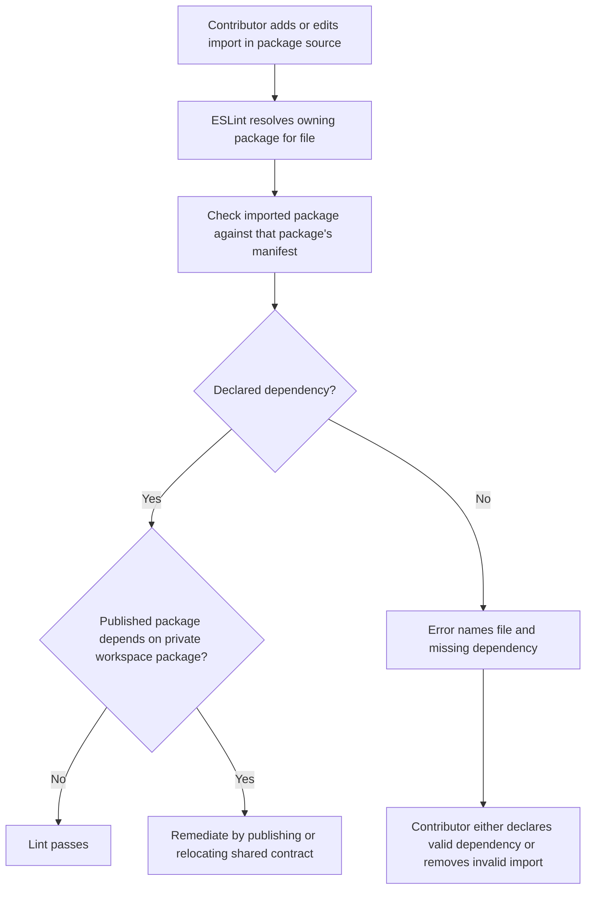
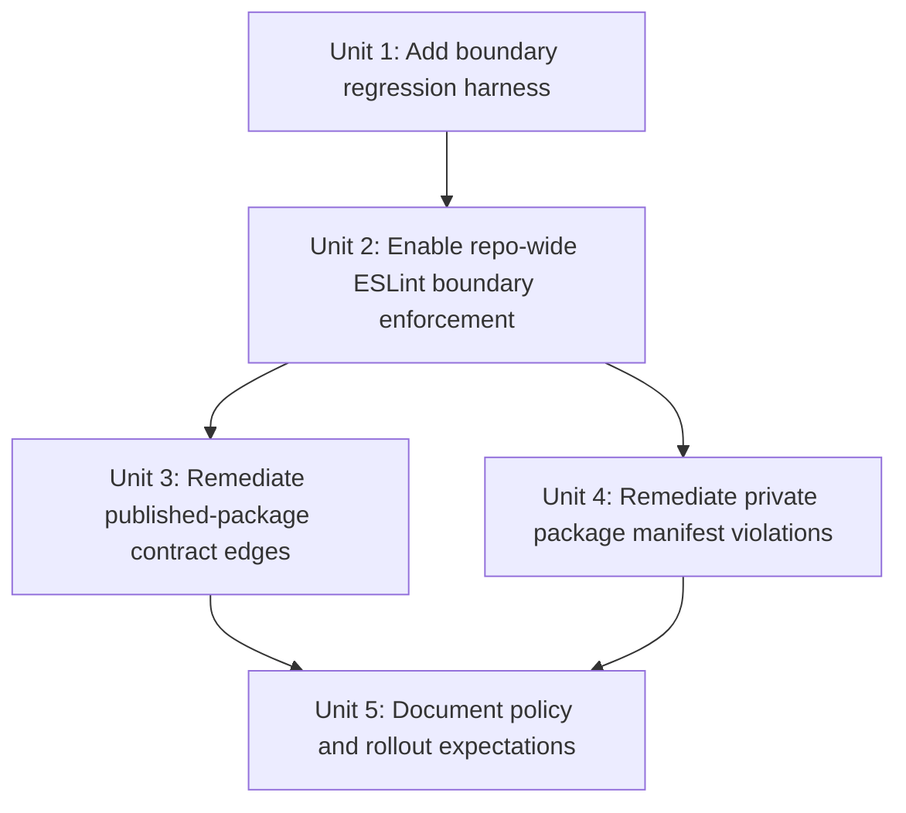

# refactor: enforce monorepo import boundaries

## Overview

Add an explicit, repo-wide import-boundary gate that treats each package's `package.json` as the baseline contract for what source code may import. The first rollout should use ESLint, run through the existing `lint` path that already gates CI, and remediate current undeclared workspace dependencies so the repository becomes a truthful example of enforced package boundaries instead of relying on workspace resolution quirks.

## Problem Frame

The origin requirements document established that the repo currently presents package boundaries more strictly than it actually enforces them (see origin: `docs/brainstorms/2026-04-04-monorepo-import-boundary-enforcement-requirements.md`). Source files in packages such as `pwrdrvr`, `microapps-deployer`, and `microapps-router` import internal workspace packages that are not declared in their local manifests. TypeScript project references exist, but they are not the right mechanism for expressing or enforcing import legality.

The implementation plan below treats declared dependencies as the phase-1 source of truth, keeps the first enforcement layer package-manager-independent, and preserves the option to add stricter architecture-direction rules later without blocking the immediate fix.

## Requirements Trace

- R1. Define one primary source of truth for package import legality by making package manifests the enforced baseline.
- R2. Fail undeclared imports of workspace and external packages from package source code.
- R3. Keep TypeScript references informational rather than enforcement-critical.
- R4. Run the enforcement in normal contributor workflows and CI through the existing lint path.
- R5. Produce actionable failures that point to the importing file and missing declaration.
- R6. Allow legitimate internal dependencies to be made explicit rather than implicitly resolved.
- R7. Keep the solution compatible with a future pnpm migration and optional phase-2 architecture rules.

## Scope Boundaries

- This plan does not migrate the repo from Yarn workspaces to pnpm.
- This plan does not require every current internal package import to become forbidden; legitimate edges may be legalized by declaration.
- This plan does not introduce package-direction policy in phase 1 beyond “must be declared.”
- This plan does not pull `packages/microapps-cdk` into the root lint configuration; that package remains projen-managed and excluded from root lint for this rollout.

## Context & Research

### Relevant Code and Patterns

- Root linting is centralized through `.eslintrc`, `.eslintignore`, and the root `lint` script in `package.json`.
- CI already runs `yarn lint` in `.github/workflows/ci.yml` and `.github/workflows/main-build.yml`, so the cleanest phase-1 gate is to strengthen the existing lint command rather than introduce a separate required workflow.
- The repo already depends on `eslint-plugin-import`, `eslint-import-resolver-node`, and `eslint-import-resolver-typescript` in the root `package.json`, so no new linting family needs to be introduced for baseline enforcement.
- `packages/microapps-cdk/.eslintrc.json` already uses `import/no-extraneous-dependencies`, but that config is scoped to the projen-managed package and is excluded from root lint.
- Existing internal dependency declarations use plain workspace-compatible version ranges such as `"*"` in `packages/microapps-router-lib/package.json` and `packages/microapps-edge-to-origin/package.json`.
- Current known undeclared internal imports include:
  - `packages/pwrdrvr/src/lib/DeployClient.ts`, `packages/pwrdrvr/src/lib/S3Uploader.ts`, and `packages/pwrdrvr/src/lib/S3TransferUtility.ts` importing `@pwrdrvr/microapps-deployer-lib`
  - `packages/microapps-deployer/src/...` importing `@pwrdrvr/microapps-deployer-lib` and `@pwrdrvr/microapps-datalib`
  - `packages/microapps-router/src/index.ts` importing `@pwrdrvr/microapps-datalib` and `@pwrdrvr/microapps-router-lib`

### Institutional Learnings

- No `docs/solutions/` knowledge base exists in this repository, so there are no prior solution docs to carry forward.

### External References

- `eslint-plugin-import` rule docs for `no-extraneous-dependencies`, especially monorepo-oriented `packageDir` configuration: [import-js/eslint-plugin-import](https://github.com/import-js/eslint-plugin-import/blob/main/docs/rules/no-extraneous-dependencies.md)
- pnpm workspace protocol guidance for future explicit internal dependency declarations: [pnpm workspace docs](https://pnpm.io/workspaces)
- pnpm settings guidance on hoisting and phantom dependency visibility: [pnpm settings](https://pnpm.io/settings)

## Key Technical Decisions

- Use `import/no-extraneous-dependencies` as the phase-1 enforcement mechanism.
  - Rationale: the repo already uses ESLint everywhere that matters, the rule directly checks manifest declarations, and it survives a later pnpm migration.
- Make the existing root `lint` command the primary enforcement entry point.
  - Rationale: local contributors already run it, CI already requires it, and `lint-staged` already runs ESLint on changed files.
- Configure linting to evaluate package source files against package-local manifests rather than only the repo root.
  - Rationale: a root-only interpretation would miss the actual monorepo boundary problem and would not satisfy R1/R2.
- Remediate current undeclared internal dependencies by making valid edges explicit in package manifests during the same rollout.
  - Rationale: turning on enforcement without cleaning existing violations would fail immediately and blur the distinction between real policy and existing drift.
- Preserve publishability for public packages while remediating internal dependencies.
  - Rationale: `pwrdrvr` is a published package, while `@pwrdrvr/microapps-deployer-lib` is currently private; the rollout must not “fix” linting by creating an undeployable or unpublishable package relationship.
- Defer package-direction architecture policy to a second phase.
  - Rationale: the current gap is undeclared dependency enforcement, not yet a fully modeled “A may depend on B but not C” graph. Phase 1 should close the real hole first.
- Keep `packages/microapps-cdk` out of the initial root rollout.
  - Rationale: it is already managed by projen with a separate ESLint config, and pulling it into the same enforcement change would add avoidable coupling to the first phase.

## Open Questions

### Resolved During Planning

- Which enforcement mechanism should be the first gate?
  - Resolution: use `import/no-extraneous-dependencies` as the phase-1 repo-wide gate, with optional architecture-graph tooling deferred.
- Where should enforcement run by default?
  - Resolution: through the existing root `lint` command and the CI jobs that already execute `yarn lint`.
- How should published packages be handled when they import internal workspace contracts?
  - Resolution: phase 1 must keep published packages distributable. For `pwrdrvr`, remediation may not stop at adding a manifest entry; it must either make the shared contract package publishable or move the contract to a publishable location before the edge is considered valid.
- Should higher-level package direction rules land in phase 1?
  - Resolution: no. Phase 1 enforces declaration correctness; package-direction policy is a follow-on phase once the repo is clean.

### Deferred to Implementation

- Exact `packageDir`/override layout in `.eslintrc`
  - Why deferred: the implementer should confirm the cleanest array of package directories and any source-vs-test overrides while editing the real config.
- Whether to add a dedicated audit helper script in addition to fixture-based regression coverage
  - Why deferred: the need depends on how noisy the first enforcement pass is once config is wired up.
- Whether the repo wants to convert internal package ranges from `"*"` to `workspace:*` during a later pnpm migration
  - Why deferred: that is a package-manager migration concern, not required for the current enforcement rollout.

## High-Level Technical Design

> *This illustrates the intended approach and is directional guidance for review, not implementation specification. The implementing agent should treat it as context, not code to reproduce.*

## Implementation Units

- [ ] **Unit 1: Add boundary regression harness**

**Goal:** Create a small, durable verification harness that proves the boundary rule catches undeclared imports and allows declared ones.

**Requirements:** R1, R2, R4, R5

**Dependencies:** None

**Files:**
- Create: `tests/tooling/import-boundaries.spec.ts`
- Create: `tests/fixtures/import-boundaries/valid-package/package.json`
- Create: `tests/fixtures/import-boundaries/valid-package/src/index.ts`
- Create: `tests/fixtures/import-boundaries/invalid-package/package.json`
- Create: `tests/fixtures/import-boundaries/invalid-package/src/index.ts`
- Modify: `tests/tsconfig.json`

**Approach:**
- Add a focused test harness that runs ESLint against fixture packages representing at least one declared workspace-style import and one undeclared import.
- Keep the fixtures intentionally tiny so they verify boundary behavior without depending on the real repo package graph.
- Structure the harness so it can validate the resolved ESLint config rather than duplicating rule logic in the test.

**Patterns to follow:**
- `tests/integration/demo-app.spec.ts`
- `tests/integration/nextjs-demo.spec.ts`

**Test scenarios:**
- Happy path: linting the `valid-package` fixture succeeds when the imported package is declared in that fixture's manifest.
- Error path: linting the `invalid-package` fixture fails with an extraneous-dependency error that identifies the offending file/import.
- Edge case: a fixture using a TypeScript source file still resolves through the shared ESLint TypeScript parser configuration.
- Integration: the test harness uses the same `.eslintrc` entry point the repo's `lint` command uses, so drift between config and regression coverage is visible.

**Verification:**
- The tooling spec fails if the boundary rule stops flagging undeclared imports or starts rejecting the declared fixture unexpectedly.

- [ ] **Unit 2: Enable repo-wide ESLint boundary enforcement**

**Goal:** Turn the root lint configuration into the phase-1 source of truth for declared dependency enforcement across package source files.

**Requirements:** R1, R2, R3, R4, R5, R7

**Dependencies:** Unit 1

**Files:**
- Modify: `.eslintrc`
- Modify: `.eslintignore`
- Modify: `package.json`
- Test: `tests/tooling/import-boundaries.spec.ts`

**Approach:**
- Add `import/no-extraneous-dependencies` to the root config for package source files, using package-local manifest lookup rather than a repo-root-only check.
- Add the minimal overrides needed so source files are held to `dependencies` while test files and allowed tooling files can still use `devDependencies`.
- Preserve the current root lint entry point unless implementation proves that a separate wrapper script materially improves clarity.
- Keep `packages/microapps-cdk` excluded from the root rollout and avoid changing its generated config in this phase.

**Execution note:** Start with the failing fixture test from Unit 1, then tighten `.eslintrc` until the invalid fixture fails for the right reason.

**Technical design:** A root ESLint rule with per-path overrides should be the only required phase-1 policy layer; the package manager remains an implementation detail beneath that policy.

**Patterns to follow:**
- `.eslintrc`
- `packages/microapps-cdk/.eslintrc.json`
- `package.json`

**Test scenarios:**
- Happy path: a real package source file importing a dependency that is listed in its local `package.json` is accepted.
- Error path: a package source file importing a workspace package omitted from its local manifest fails the rule.
- Edge case: test files and other explicitly allowed non-production paths may still use `devDependencies` without tripping the source-code boundary rule.
- Edge case: deep imports such as `@scope/pkg/subpath` are evaluated against the owning package declaration, not treated as unrelated packages.
- Integration: the root `lint` command exercises the same rule set that CI executes in `.github/workflows/ci.yml` and `.github/workflows/main-build.yml`.

**Verification:**
- Running the repo lint workflow would fail for undeclared source imports and continue to pass for declared imports and approved test/tooling exceptions.

- [ ] **Unit 3: Remediate published-package contract edges**

**Goal:** Bring published-package violations into compliance without creating unpublished dependency chains for released artifacts.

**Requirements:** R2, R5, R6

**Dependencies:** Unit 2

**Files:**
- Modify: `packages/pwrdrvr/package.json`
- Modify: `packages/microapps-deployer-lib/package.json`
- Modify: `packages/microapps-deployer-lib/tsconfig.json`
- Modify: `packages/pwrdrvr/src/lib/DeployClient.ts`
- Modify: `packages/pwrdrvr/src/lib/S3Uploader.ts`
- Modify: `packages/pwrdrvr/src/lib/S3TransferUtility.ts`
- Modify: `.github/workflows/main-build.yml`
- Modify: `.github/workflows/release.yml`
- Test: `tests/tooling/import-boundaries.spec.ts`

**Approach:**
- Classify the `pwrdrvr -> @pwrdrvr/microapps-deployer-lib` edge as a published-package contract problem, not just a missing manifest entry.
- Choose the smallest remediation that keeps `pwrdrvr` distributable: either make `microapps-deployer-lib` publishable in the same way other shared published libs are handled, or relocate the shared contract into an already-publishable package.
- Keep the lint policy strict for type-only imports as well; do not create a special exemption for “types only,” because the generated `.d.ts` surface of a published package still needs resolvable dependencies.
- If `microapps-deployer-lib` becomes publishable, align its packaging metadata and dry-run publish coverage with the repo's other distributable libraries.

**Patterns to follow:**
- `packages/microapps-datalib/package.json`
- `packages/microapps-router-lib/package.json`
- `.github/workflows/main-build.yml`
- `.github/workflows/release.yml`

**Test scenarios:**
- Happy path: `packages/pwrdrvr/src/lib/DeployClient.ts` and the other `pwrdrvr` deployer-lib imports pass once the shared contract is both declared and distributable.
- Edge case: type-only imports from `@pwrdrvr/microapps-deployer-lib` are still treated as dependency-bearing for a published package's generated type surface.
- Error path: a remediation attempt that keeps `pwrdrvr` importing a private unpublished workspace package still fails either the boundary gate or publishability verification.
- Integration: the dry-run publish workflows in both `.github/workflows/main-build.yml` and `.github/workflows/release.yml` continue to succeed for `pwrdrvr` and any newly publishable shared contract package after remediation.

**Verification:**
- `pwrdrvr` remains publishable while no longer relying on undeclared internal type contracts.

- [ ] **Unit 4: Remediate private package manifest violations**

**Goal:** Bring private service and Lambda package manifests into compliance with the new rule by declaring legitimate internal dependencies explicitly.

**Requirements:** R2, R5, R6

**Dependencies:** Unit 2

**Files:**
- Modify: `packages/microapps-deployer/package.json`
- Modify: `packages/microapps-router/package.json`
- Modify: `packages/microapps-deployer/src/index.ts`
- Modify: `packages/microapps-deployer/src/controllers/AppController.ts`
- Modify: `packages/microapps-deployer/src/controllers/ConfigController.ts`
- Modify: `packages/microapps-deployer/src/controllers/version/DeployVersion.ts`
- Modify: `packages/microapps-deployer/src/controllers/version/DeployVersionLite.ts`
- Modify: `packages/microapps-deployer/src/controllers/version/DeployVersionPreflight.ts`
- Modify: `packages/microapps-deployer/src/controllers/version/DeleteVersion.ts`
- Modify: `packages/microapps-deployer/src/controllers/version/GetVersion.ts`
- Modify: `packages/microapps-deployer/src/controllers/version/LambdaAlias.ts`
- Modify: `packages/microapps-deployer/src/lib/GetAppNameOrRootTrailingSlash.ts`
- Modify: `packages/microapps-deployer/src/lib/GetBucketPrefix.ts`
- Modify: `packages/microapps-router/src/index.ts`
- Test: `tests/tooling/import-boundaries.spec.ts`

**Approach:**
- Audit the private packages currently failing the new rule and classify each edge as either legitimate-and-missing-from-manifest or actually undesired.
- For edges that are legitimate, add explicit workspace dependency declarations using the repo's current internal package versioning convention.
- Only remove or reroute imports when the dependency direction is actually wrong; do not force architectural refactors just to satisfy phase-1 declaration checks.
- Re-run the lint boundary gate after each package manifest change to keep the remediation set tight and understandable.

**Patterns to follow:**
- `packages/microapps-router-lib/package.json`
- `packages/microapps-edge-to-origin/package.json`
- `packages/microapps-deployer/package.json`

**Test scenarios:**
- Happy path: `packages/microapps-deployer/src/...` imports of `@pwrdrvr/microapps-deployer-lib` and `@pwrdrvr/microapps-datalib` pass after manifest remediation.
- Happy path: `packages/microapps-router/src/index.ts` passes after its internal library dependencies are declared.
- Error path: if an internal import remains undeclared in any remediated private package, lint still fails and points to the remaining violation.
- Integration: the full repo lint run passes on the real private-package graph without weakening the new boundary rule.

**Verification:**
- All currently legitimate internal imports for private packages are declared explicitly in their owning manifests, and the repo lint gate no longer relies on accidental workspace resolution.

- [ ] **Unit 5: Document policy and rollout expectations**

**Goal:** Explain the new boundary rule to maintainers and contributors so future package changes follow the same contract intentionally.

**Requirements:** R1, R4, R7

**Dependencies:** Units 3 and 4

**Files:**
- Modify: `README.md`
- Modify: `AGENTS.md`
- Test: `tests/tooling/import-boundaries.spec.ts`

**Approach:**
- Add a concise contributor-facing note that package source imports must be declared in the importing package's `package.json`, and that the repo enforces this through lint.
- Document the phase-1 boundary contract separately from any future pnpm migration or phase-2 architecture graph so readers understand what is enforced today.
- Add a brief maintainer note in `AGENTS.md` describing the special handling of `packages/microapps-cdk` and the fact that TypeScript references are not the boundary source of truth.

**Patterns to follow:**
- `README.md`
- `AGENTS.md`

**Test scenarios:**
- Test expectation: none -- this unit is documentation-only, and the behavioral enforcement is already covered by `tests/tooling/import-boundaries.spec.ts`.

**Verification:**
- A contributor reading the repo docs can understand the rule, the reason for it, and how to fix a failure without having to infer behavior from CI alone.

## System-Wide Impact

- **Interaction graph:** This change touches root lint configuration, per-package manifests, contributor workflow via `lint-staged`, and CI lint jobs in `.github/workflows/ci.yml` and `.github/workflows/main-build.yml`.
- **Error propagation:** Boundary violations should surface first as ESLint errors in local development and then identically in CI; no runtime or build-only discovery should be required.
- **State lifecycle risks:** Package manifest updates affect published package metadata, so legitimate internal dependency additions must remain semantically correct for packaging and dry-run publish workflows. Published-package edges need extra scrutiny because type-only imports can still leak into generated `.d.ts` output.
- **API surface parity:** The rule should behave consistently across `pwrdrvr`, Lambda packages, shared libraries, and future packages added under `packages/`, while intentionally excluding the projen-managed `microapps-cdk` subtree from phase 1.
- **Integration coverage:** The fixture-based regression harness plus full-repo lint run are both needed; fixtures prove the rule semantics, and the real repo lint run proves there are no hidden violations left in the existing package graph.
- **Unchanged invariants:** This plan does not change request routing, deployment logic, or TypeScript build outputs. It changes only how the repo validates package import legality.

## Risks & Dependencies

| Risk | Mitigation |
|------|------------|
| Root ESLint config checks only the repo root manifest and misses per-package boundaries | Configure package-local manifest lookup and prove it with fixture-based regression coverage |
| Phase 1 “fixes” `pwrdrvr` by depending on a private unpublished package | Treat published-package edges as a separate remediation unit and verify publishability, not just lint cleanliness |
| Existing undeclared internal imports are more widespread than the first scan showed | Use the rule itself to drive a systematic remediation pass before considering the rollout complete |
| Test/tooling paths are accidentally held to production dependency rules | Use explicit overrides for tests/tooling and cover them in the regression harness |
| `packages/microapps-cdk` complicates the rollout due to separate generated lint config | Keep it out of phase 1 and document the exception explicitly |
| Future pnpm migration reintroduces ambiguity around internal dependency declarations | Keep phase-1 enforcement package-manager-independent now, and document that a later pnpm move should prefer explicit workspace declarations |

## Documentation / Operational Notes

- No new CI workflow is required if the strengthened rule is enforced through the existing `yarn lint` jobs.
- If implementation reveals that lint output is too noisy, a focused `lint:boundaries` helper can be added as a convenience command without replacing the primary root lint gate.
- A later phase may add explicit architecture-direction tooling once the repo is clean under declared dependency enforcement.

## Sources & References

- **Origin document:** [docs/brainstorms/2026-04-04-monorepo-import-boundary-enforcement-requirements.md](docs/brainstorms/2026-04-04-monorepo-import-boundary-enforcement-requirements.md)
- Related code: `.eslintrc`
- Related code: `package.json`
- Related code: `.github/workflows/ci.yml`
- Related code: `.github/workflows/main-build.yml`
- Related code: `.github/workflows/release.yml`
- Related code: `packages/pwrdrvr/package.json`
- Related code: `packages/microapps-deployer-lib/package.json`
- Related code: `packages/microapps-deployer/package.json`
- Related code: `packages/microapps-router/package.json`
- External docs: [eslint-plugin-import no-extraneous-dependencies](https://github.com/import-js/eslint-plugin-import/blob/main/docs/rules/no-extraneous-dependencies.md)
- External docs: [pnpm workspace docs](https://pnpm.io/workspaces)
- External docs: [pnpm settings](https://pnpm.io/settings)
