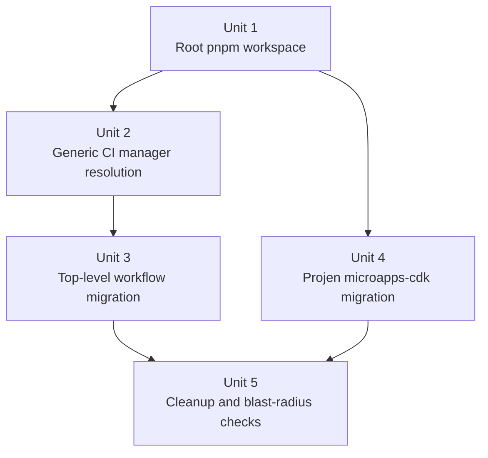

# Refactor package management to pnpm with multi-manager CI support

## Overview

Convert the monorepo from Yarn Classic-first tooling to pnpm as the primary workspace manager, while making the reusable GitHub composite action in `.github/actions/configure-nodejs/action.yml` able to bootstrap installs for `npm`, `yarn`, or `pnpm` using the correct lockfile and install command. The plan keeps published package behavior unchanged and focuses on developer/CI installation flows, generated release automation, and the root workspace layout.

## Problem Frame

The repository is currently coupled to Yarn in three places at once: the root workspace manifest and scripts, the reusable GitHub action and workflows, and the projen-managed `packages/microapps-cdk` package. The user wants pnpm to become the repo's package manager, and specifically called out the need for `.github/actions/configure-nodejs/action.yml` to understand pnpm and its lockfile. The most important technical constraint is that the repo already contains package-manager-specific history and workarounds:

- the root `package.json` uses Yarn workspace-only `nohoist`
- CI and release workflows hardcode `yarn` commands and cache keys keyed to `yarn.lock`
- `packages/microapps-cdk/.projenrc.js` explicitly sets `NodePackageManager.YARN_CLASSIC`
- contributor docs explain why `npm` was avoided because of workspace `bin` linking and dependency resolution issues

This refactor should standardize the repo on pnpm without breaking the reusable action's ability to bootstrap other Node repos that still use npm or Yarn.

## Requirements Trace

- R1. The root repo installs and runs from pnpm as the primary package manager.
- R2. `.github/actions/configure-nodejs/action.yml` can bootstrap `npm`, `yarn`, or `pnpm`, including the correct lockfile hash and install command for each manager.
- R3. CI, main-branch build, release, and jsii/package publishing workflows continue to function after the package-manager migration.
- R4. Projen-managed files under `packages/microapps-cdk` stop reintroducing Yarn-specific automation after regeneration.
- R5. Contributor-facing documentation reflects pnpm as the primary workflow, while published-package consumer docs that legitimately use `npm install` remain unchanged.

## Scope Boundaries

- Consumer documentation showing how downstream users install published packages from npm is out of scope unless it incorrectly describes repo contributor workflows.
- Re-architecting the repo's build, lint, or test topology is out of scope beyond the changes needed to make those commands run under pnpm.
- Replacing npm publish steps with pnpm publish is out of scope; publishing to npm remains an npm-facing concern.

## Context & Research

### Relevant Code and Patterns

- `package.json` defines the root workspace, Yarn-only `nohoist`, and several scripts that shell through `npm` or `yarn`.
- `.github/actions/configure-nodejs/action.yml` currently restores cached `node_modules`, hashes only `yarn.lock`, and runs `yarn --frozen-lockfile`.
- `.github/workflows/ci.yml`, `.github/workflows/main-build.yml`, and `.github/workflows/release.yml` hardcode Yarn build/install commands and Yarn-based cache keys.
- `packages/microapps-cdk/.projenrc.js` is the source of truth for generated workflow/package-manager behavior inside `packages/microapps-cdk`.
- `packages/microapps-cdk/.github/workflows/release.yml` confirms projen currently emits Yarn-specific install steps, so changing only top-level workflows would drift.

### Institutional Learnings

- No `docs/solutions/` or prior brainstorm/plan documents exist in this repo, so the plan relies on live repo patterns plus external package-manager documentation.
- `CONTRIBUTING.md` documents historic npm workspace/bin bootstrapping failures; this is a strong signal to validate pnpm against the `bin`-producing packages (`packages/pwrdrvr`, `packages/microapps-publish`) before removing Yarn-era safeguards.

### External References

- `actions/setup-node` documents built-in cache support for `npm`, `yarn`, and `pnpm`, and requires `cache-dependency-path` when the lockfile is not the default root file. It also notes that it caches package-manager data, not `node_modules`. See: https://github.com/actions/setup-node
- Corepack documents that Yarn and pnpm shims can be enabled from the Node distribution and that the `packageManager` field is the canonical way to pin the package manager/version for a project. See: https://github.com/nodejs/corepack#readme
- pnpm documents that workspaces are rooted by `pnpm-workspace.yaml`, with the root package always included, and that workspace package globs should be declared there. See: https://pnpm.io/pnpm-workspace_yaml
- projen's AWS CDK construct docs expose `packageManager` and `pnpmVersion` options, which means the generated `microapps-cdk` package can be switched at the source instead of hand-editing generated files. See: https://projen.io/docs/api/awscdk/

## Key Technical Decisions

- Adopt pnpm as the repo's single source of truth for workspace installation.
  Rationale: keeping both a root Yarn workflow and a root pnpm workflow would leave lockfiles, cache keys, and generated automation in permanent disagreement. The reusable GitHub action can remain multi-manager-capable for reuse, but this repo itself should have one primary manager.

- Detect the package manager explicitly in the composite action instead of relying on GitHub Actions' implicit defaults.
  Rationale: this repo needs one reusable action that can select lockfile names, package-manager setup, and install commands across three managers. Explicit detection keeps the behavior reviewable and prevents accidental npm/yarn/pnpm mismatches when multiple lockfiles exist.

- Change `packages/microapps-cdk/.projenrc.js` first, then regenerate generated package/workflow files.
  Rationale: `packages/microapps-cdk/package.json` and `packages/microapps-cdk/.github/workflows/*.yml` are generated artifacts. Editing those without changing `.projenrc.js` would reintroduce Yarn on the next projen run.

- Replace Yarn-specific workspace metadata deliberately rather than trying to translate it 1:1.
  Rationale: the root `nohoist` field is a Yarn Classic feature, not a pnpm workspace primitive. The migration should start with pnpm's normal workspace layout, then add only the minimum `.npmrc` hoist settings needed to satisfy jsii/CDK edge cases that actually fail under pnpm.

- Normalize root scripts toward pnpm-first or manager-neutral shells.
  Rationale: a repo that claims to use pnpm but still shells into `yarn` and `npm exec --workspaces` will remain partially migrated and harder to reason about in CI.

## Open Questions

### Resolved During Planning

- Should the reusable GitHub action stay generic even though the repo is standardizing on pnpm?
  Yes. The repo will standardize on pnpm, but the composite action should accept an explicit manager override and otherwise auto-detect from `packageManager`/lockfiles so it can continue serving mixed-manager callers.

- Should projen-managed `microapps-cdk` stay on Yarn while the root moves to pnpm?
  No. That would preserve the largest source of Yarn-specific drift in the repo and keep release workflows split across package managers.

- Should the migration depend solely on `actions/setup-node`'s built-in cache behavior?
  No. The action design should remain explicit about manager detection and lockfile selection. Whether the final cache implementation stays `node_modules`-based or moves fully to manager-store caching can be validated during implementation, but the plan should not depend on implicit defaults.

### Deferred to Implementation

- Which pnpm hoist settings, if any, are needed to satisfy jsii/projen/CDK quirks in `packages/microapps-cdk`.
  This depends on the first pnpm install/build run and should be decided from observed failures rather than guessed from the current Yarn `nohoist` list.

- Whether `node_modules` caching remains reliable for pnpm in this repo or whether the composite action should pivot to package-manager-store caching only.
  This is an execution-time validation question and should be decided from CI behavior after the generic action lands.

## High-Level Technical Design

> *This illustrates the intended approach and is directional guidance for review, not implementation specification. The implementing agent should treat it as context, not code to reproduce.*

| Detection priority | Signal | Resulting manager | Lockfile / dependency path | Setup step | Install behavior |
|---|---|---|---|---|---|
| 1 | explicit composite-action input | `npm` / `yarn` / `pnpm` | manager-specific override or default | none for npm; enable Corepack or install pnpm shim for yarn/pnpm | manager-specific frozen/CI install |
| 2 | root `package.json` `packageManager` field | inferred from pinned manager | matching lockfile in repo root | same as above | same as above |
| 3 | lockfile auto-detection | `pnpm-lock.yaml`, `yarn.lock`, `package-lock.json` / `npm-shrinkwrap.json` | detected manager | same as above | same as above |
| 4 | anything else | fail fast | n/a | none | clear error telling the caller to pass `package-manager` explicitly |

The repo migration uses that generic action shape, but the repo itself will pin `packageManager` to pnpm and commit `pnpm-lock.yaml`, so most workflows take the pnpm path by default.

## Implementation Units

- [x] **Unit 1: Establish pnpm as the root workspace manager**

**Goal:** Convert the root repo metadata and lockfile to pnpm so installs, script execution, and workspace resolution are rooted in pnpm rather than Yarn Classic.

**Requirements:** R1, R5

**Dependencies:** None

**Files:**
- Create: `pnpm-workspace.yaml`
- Create: `.npmrc` (if pnpm hoist/store settings are needed)
- Create: `tests/package-manager/pnpm-workspace-smoke.test.ts`
- Modify: `package.json`
- Modify: `.gitignore` (only if new pnpm artifacts need ignore rules)
- Modify: `CLAUDE.md`
- Modify: `CONTRIBUTING.md`
- Delete: `yarn.lock`
- Create: `pnpm-lock.yaml`

**Approach:**
- Add a root `packageManager` pin for pnpm and move workspace package globs into `pnpm-workspace.yaml`.
- Rewrite root scripts that currently shell through `yarn` or `npm exec --workspaces` so they have pnpm-first or manager-neutral semantics.
- Remove the Yarn-only `nohoist` field and replace it only with the minimum pnpm settings that are proven necessary after the first install/build pass.
- Update contributor docs to describe pnpm as the repo's install/build path, while leaving end-user package-consumer examples alone unless they refer to repo development.

**Patterns to follow:**
- Root workspace declarations and scripts in `package.json`
- Existing contributor guidance structure in `CONTRIBUTING.md`

**Test scenarios:**
- Happy path: fresh install at repo root produces a committed `pnpm-lock.yaml` and completes without requiring Yarn.
- Happy path: root lifecycle scripts used by CI (`build`, `build:publish`, `lint`, `test`, `test:integration`) still resolve their workspace dependencies after the script rewrites.
- Edge case: workspace packages with `bin` entries (`packages/pwrdrvr`, `packages/microapps-publish`) link successfully under pnpm without the historic npm circular-link failure described in `CONTRIBUTING.md`.
- Error path: if pnpm exposes undeclared dependency/hoist assumptions, the resulting failure points to the package that needs an explicit dependency or hoist configuration rather than silently succeeding with a stale Yarn layout.

**Verification:**
- The repo has a single committed root lockfile (`pnpm-lock.yaml`), the root scripts no longer require Yarn, and contributor docs identify pnpm as the standard development workflow.

- [x] **Unit 2: Introduce a tested package-manager resolution layer for CI bootstrap**

**Goal:** Make `.github/actions/configure-nodejs/action.yml` package-manager aware so it can set up `npm`, `yarn`, or `pnpm`, hash the right lockfile, and run the correct install command.

**Requirements:** R2

**Dependencies:** Unit 1

**Files:**
- Create: `scripts/package-manager/resolve-manager.mjs`
- Create: `tests/package-manager/resolve-manager.test.ts`
- Modify: `.github/actions/configure-nodejs/action.yml`

**Approach:**
- Move manager detection and lockfile resolution into a small script or helper artifact that the composite action can call, rather than hardcoding Yarn assumptions directly in YAML.
- Support an explicit `package-manager` input first, then fall back to root `package.json` `packageManager`, then lockfile detection.
- Compute manager-specific install commands and cache dependency paths in one place so workflows do not duplicate package-manager branching logic.
- Preserve the existing `lookup-only` contract only if the final cache approach still benefits from it; otherwise, simplify the action interface and update callers in the workflow unit.

**Execution note:** Start with failing tests around manager resolution before editing the composite action so the lockfile-selection contract is pinned down.

**Patterns to follow:**
- Existing reusable-action boundary in `.github/actions/configure-nodejs/action.yml`
- Existing Jest test setup in `jest.config.js` and `tests/`

**Test scenarios:**
- Happy path: explicit `package-manager=pnpm` resolves `pnpm-lock.yaml` and selects pnpm install behavior.
- Happy path: explicit `package-manager=yarn` resolves `yarn.lock` and selects Yarn Classic install behavior.
- Happy path: explicit `package-manager=npm` resolves `package-lock.json` or `npm-shrinkwrap.json` and selects `npm ci`.
- Edge case: no explicit input but root `package.json` contains `packageManager: pnpm@...`; the helper selects pnpm even if a stale secondary lockfile exists elsewhere.
- Error path: no supported lockfile and no explicit input produces a clear configuration error instead of silently defaulting to the wrong manager.
- Integration: the composite action consumes the helper output and produces stable cache/install settings for all three managers.

**Verification:**
- The composite action can be reviewed as a thin wrapper over a tested manager-resolution contract instead of embedding all manager-selection logic in YAML.

- [x] **Unit 3: Migrate repo workflows and cache keys to the new manager contract**

**Goal:** Update CI and release workflows to use the generic action and pnpm-rooted commands/lockfiles without breaking build, test, deploy, or release flows.

**Requirements:** R1, R2, R3

**Dependencies:** Unit 2

**Files:**
- Create: `tests/package-manager/ci-bootstrap-contract.test.ts`
- Modify: `.github/workflows/ci.yml`
- Modify: `.github/workflows/main-build.yml`
- Modify: `.github/workflows/release.yml`
- Modify: `package.json`

**Approach:**
- Replace direct `yarn` invocations in top-level workflows with pnpm-rooted commands or explicit calls through the generic setup contract.
- Update cache keys that currently hash only `yarn.lock` so they include the detected manager and the manager-appropriate lockfile.
- Revisit the `install-deps` / `lookup-only` pattern once the new action behavior is in place; keep it only if it still saves real work under pnpm.
- Audit any workflow steps that read artifacts from `node_modules` paths to ensure pnpm's layout still leaves those package entry points reachable from the same logical locations.

**Patterns to follow:**
- Current workflow decomposition across `install-deps`, `build`, `test`, `deploy`, and `build-jsii` in `.github/workflows/ci.yml`
- Existing reusable-action usage in `main-build.yml` and `release.yml`

**Test scenarios:**
- Happy path: CI build/test jobs install dependencies through the updated action and complete using pnpm-rooted commands.
- Happy path: release and main-build workflows continue to build the root repo and publish artifacts without requiring Yarn on the runner.
- Edge case: cache keys change when the package manager or lockfile changes, preventing reuse of incompatible caches across npm/yarn/pnpm.
- Integration: workflow steps that read published app versions from installed packages under `node_modules` still resolve successfully after pnpm installation.
- Integration: jsii/package jobs that depend on the root install can still build the CDK construct and downstream artifacts.

**Verification:**
- Top-level workflows no longer assume `yarn.lock` or `yarn install`, and the package-manager bootstrap path is centralized through the generic action or a consciously retained equivalent.

- [x] **Unit 4: Convert projen-managed `microapps-cdk` automation to pnpm and regenerate**

**Goal:** Align the projen-managed CDK package with the repo-wide pnpm decision so generated package metadata and release workflows stop reintroducing Yarn-specific behavior.

**Requirements:** R3, R4

**Dependencies:** Unit 1

**Files:**
- Modify: `packages/microapps-cdk/.projenrc.js`
- Modify: `packages/microapps-cdk/package.json`
- Modify: `packages/microapps-cdk/.github/workflows/build.yml`
- Modify: `packages/microapps-cdk/.github/workflows/pull-request-lint.yml`
- Modify: `packages/microapps-cdk/.github/workflows/release.yml`
- Modify: `packages/microapps-cdk/.github/workflows/upgrade-main.yml`
- Create: `packages/microapps-cdk/test/package-manager-smoke.test.ts`
- Delete: `packages/microapps-cdk/yarn.lock`
- Create: `packages/microapps-cdk/pnpm-lock.yaml` (only if projen still emits a package-local lockfile after the source-of-truth change)

**Approach:**
- Switch `.projenrc.js` from `YARN_CLASSIC` to PNPM and set an explicit pnpm version so generated workflows are deterministic.
- Regenerate the package and review the generated workflow deltas instead of hand-editing generated files.
- Decide during implementation whether `packages/microapps-cdk` should keep an isolated lockfile or rely solely on the repo root workspace lockfile; prefer the simpler single-lockfile model if projen and release packaging tolerate it.
- Update any generated install steps in the CDK package workflows that still assume Yarn-specific flags.

**Patterns to follow:**
- Generated-file ownership comment in `packages/microapps-cdk/package.json`
- Existing projen source-of-truth model in `packages/microapps-cdk/.projenrc.js`

**Test scenarios:**
- Happy path: regenerating projen outputs after the package-manager switch yields pnpm-oriented install steps instead of Yarn ones.
- Edge case: package-local workflow generation does not reintroduce a second package manager after the root repo has standardized on pnpm.
- Integration: `packages/microapps-cdk` build/package/release flows still execute with the regenerated metadata and workflow files.
- Error path: if projen cannot cleanly operate inside the monorepo with pnpm, the failure is surfaced at the source-of-truth layer (`.projenrc.js`/generation) rather than being patched post-generation.

**Verification:**
- Running the repo's regeneration flow for `packages/microapps-cdk` no longer produces Yarn-specific workflow/package-manager artifacts.

- [x] **Unit 5: Finish migration cleanup and blast-radius checks**

**Goal:** Remove remaining Yarn-first repo guidance and confirm the migration did not accidentally change publishing or runtime behavior.

**Requirements:** R1, R3, R5

**Dependencies:** Units 1-4

**Files:**
- Modify: `CLAUDE.md`
- Modify: `CONTRIBUTING.md`
- Modify: `.github/actions/configure-nodejs/action.yml`
- Modify: `.github/workflows/ci.yml`
- Modify: `.github/workflows/main-build.yml`
- Modify: `.github/workflows/release.yml`

**Approach:**
- Sweep the repo for stale `yarn` guidance that now refers to contributor workflows, caches, or lockfiles.
- Confirm any remaining npm references are genuinely about published-package consumption or npm publishing, not repo development.
- Tighten documentation around the generic CI action so future callers know when to rely on auto-detection and when to pass an explicit manager.

**Patterns to follow:**
- Existing troubleshooting sections in `CLAUDE.md` and `CONTRIBUTING.md`

**Test scenarios:**
- Test expectation: none -- this unit is documentation and cleanup over already-validated behavior.

**Verification:**
- A repo-wide search no longer presents Yarn as the development default, and the remaining package-manager references are intentional and context-specific.

## System-Wide Impact

- **Interaction graph:** the root workspace, reusable CI bootstrap action, top-level GitHub workflows, and projen-managed CDK subproject all participate in installation/build orchestration and must agree on the package manager.
- **Error propagation:** pnpm is stricter about undeclared/hoisted dependencies than Yarn Classic; install or build failures are likely to surface missing dependency declarations that Yarn previously masked.
- **State lifecycle risks:** mixed lockfiles or mixed generated workflows can create non-reproducible CI behavior where one job installs with pnpm and another regenerates Yarn-specific artifacts.
- **API surface parity:** the composite action's inputs and outputs are now a shared interface for this repo and any other caller that wants npm/yarn/pnpm support.
- **Integration coverage:** the highest-risk integrations are CI bootstrap, jsii/projen generation, and the release packaging jobs that currently reinstall dependencies in checked-out artifact directories.
- **Unchanged invariants:** published package names, npm publish destinations, runtime entry points, and the repo's build/test goals stay the same; only the install/bootstrap mechanism changes.

## Risks & Dependencies

| Risk | Mitigation |
|------|------------|
| pnpm exposes hidden dependency or hoist assumptions that Yarn masked | Validate the root build/test and `packages/microapps-cdk` flows early, then add the smallest necessary `.npmrc` hoist settings instead of broad hoisting by default |
| The generic CI action becomes overcomplicated or ambiguous when multiple lockfiles exist | Make explicit `package-manager` input highest priority, back it with tests, and fail fast on ambiguous detection |
| Projen regeneration reintroduces Yarn-specific files after root migration | Update `packages/microapps-cdk/.projenrc.js` before touching generated outputs, and review generated diffs as part of the migration |
| Cache reuse across managers causes corrupted installs | Include the detected manager and manager-specific lockfile hash in cache identity, or drop cache layers that cannot be proven safe under pnpm |

## Documentation / Operational Notes

- The migration should update developer-facing docs (`CONTRIBUTING.md`, `CLAUDE.md`) to pnpm-first language.
- The reusable action should document its manager-detection precedence so future workflow edits do not accidentally rely on stale lockfile conventions.
- If the repo keeps any npm or Yarn compatibility path for CI reuse, document that as action-level compatibility, not as the repo's primary development workflow.

## Sources & References

- Related code: `package.json`
- Related code: `.github/actions/configure-nodejs/action.yml`
- Related code: `.github/workflows/ci.yml`
- Related code: `.github/workflows/main-build.yml`
- Related code: `.github/workflows/release.yml`
- Related code: `packages/microapps-cdk/.projenrc.js`
- Related code: `packages/microapps-cdk/.github/workflows/release.yml`
- External docs: https://github.com/actions/setup-node
- External docs: https://github.com/nodejs/corepack#readme
- External docs: https://pnpm.io/pnpm-workspace_yaml
- External docs: https://projen.io/docs/api/awscdk/
