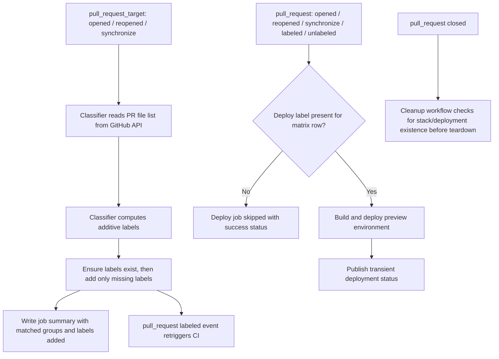

# feat: Add preview deploy scope classifier

## Overview

Add an early pull-request scope classifier that inspects changed files, additively applies deploy labels, and makes preview deployment opt-in by label for PRs. The implementation should preserve the current push-to-main deployment path, keep existing deploy-shape labels, and make the deploy decision legible from the PR UI and workflow summaries.

## Problem Frame

Preview AWS environments currently deploy from PRs even when the changed files are clearly non-runtime. The origin requirements define a new control plane: PR previews default to off, an early classifier adds labels conservatively, and downstream preview deploy behavior keys off those labels instead of implicit workflow execution (see origin: `docs/brainstorms/2026-04-04-preview-deploy-auto-labeling-requirements.md`).

This is primarily a GitHub Actions orchestration change, not an application-runtime redesign. The work needs to stay safe for PRs targeting this repository from fork branches, which means label classification and mutation must be separated from any workflow that builds or runs PR code with repository secrets.

## Requirements Trace

- R1. PRs default to no AWS preview deployment unless deploy labels are present.
- R2. Preview eligibility is decided early by a dedicated classifier instead of scattered late conditions.
- R3. Downstream deploy jobs treat labels as the control plane for whether preview environments run.
- R4. The classifier inspects changed files and conservatively auto-adds labels for likely deploy-affecting changes.
- R5. Conservative matches include workflow, deploy, and CDK-related paths.
- R6. Auto-labeling is additive only and never strips deploy labels.
- R7. Label classification works for PRs targeting this repository, including fork-branch PRs.
- R8. `DEPLOY-CORE` becomes the primary gate for the main preview deployment.
- R9. `DEPLOY-BASIC` and `DEPLOY-BASIC-PREFIX` remain in use in this phase.
- R10. Conservative matches add `DEPLOY-CORE` by default.
- R11. Extra preview labels are added only for paths strongly tied to those environments.
- R12. Maintainers can force preview deploys by manually adding labels.
- R13. Human-added labels are never removed by automation.
- R14. Reviewers can understand the deploy decision from PR-visible artifacts.

## Scope Boundaries

- This plan does not redesign the main-branch or release deployment pipelines.
- This plan does not replace the current label taxonomy with a brand-new scheme.
- This plan does not automatically undeploy preview stacks when labels are removed from an open PR.
- This plan does not require repository-wide policy changes for secrets on fork PRs; it only makes the classifier itself fork-safe.

## Context & Research

### Relevant Code and Patterns

- `.github/workflows/ci.yml` currently deploys `microapps-core` unconditionally on PRs and gates only `microapps-basic` / `microapps-basic-prefix` via label-driven matrix exclusions.
- `.github/workflows/ci.yml` already uses `actions/github-script@v7` for commit statuses and deployment status publishing, so GitHub API orchestration in workflow code is an established pattern.
- `.github/workflows/pr-closed.yml` always iterates the three preview stack names during cleanup, regardless of whether that environment was actually deployed for the PR.
- `packages/cdk/bin/cdk.ts` defines the three preview stack families: `microapps-core`, `microapps-basic`, and `microapps-basic-prefix`, which is the strongest repo signal for when extra preview labels should be emitted.
- `scripts/package-manager/resolve-manager.mjs` plus `tests/package-manager/resolve-manager.spec.ts` provide a good repo-local pattern for a small root-level Node helper with regression coverage.

### Institutional Learnings

- No relevant `docs/solutions/` entries were present for workflow orchestration or preview deploy labeling in this worktree.

### External References

- GitHub documents `pull_request_target` as running in the base repository context and explicitly positions it for labeling or commenting on fork PRs, while warning against building or running pull-request code there. That supports a fork-safe classifier workflow but not moving the deploy/build path to `pull_request_target`. [GitHub Docs](https://docs.github.com/en/actions/reference/workflows-and-actions/events-that-trigger-workflows)
- GitHub’s labels API treats PR labels as issue labels and requires write permission on `Issues` or `Pull requests`, which is sufficient for additive label creation and application from the classifier workflow. [GitHub Docs](https://docs.github.com/en/rest/issues/labels)
- GitHub’s “List pull request files” endpoint is available with read access to pull requests, which fits a classifier that derives decisions from GitHub metadata even if it checks out only trusted base-repository helper code. [GitHub Docs](https://docs.github.com/en/rest/pulls/pulls?apiVersion=2022-11-28#list-pull-requests-files)
- GitHub documents that skipped jobs report success, which matters because label-gated deploy jobs will intentionally skip on unlabeled PR runs. [GitHub Docs](https://docs.github.com/en/enterprise-server%403.20/actions/how-tos/write-workflows/choose-when-workflows-run/control-jobs-with-conditions)

## Key Technical Decisions

- Use a dedicated `pull_request_target` classifier workflow rather than folding label logic into `ci.yml`.
  Rationale: the classifier must safely label fork-targeting PRs without executing untrusted PR code, and GitHub’s documented semantics for `pull_request_target` fit that narrow responsibility.
- Keep preview deployment itself on the existing PR CI path rather than moving deploy jobs to `pull_request_target`.
  Rationale: the deploy path builds and runs repository code with cloud credentials, which is exactly the unsafe combination GitHub warns against for `pull_request_target`.
- Introduce `DEPLOY-CORE` as the explicit gate for the main preview environment, and continue using `DEPLOY-BASIC` / `DEPLOY-BASIC-PREFIX` as extra-environment selectors.
  Rationale: this preserves current label semantics where they already exist while making the primary preview deploy explicit.
- Add labels only; never auto-remove them.
  Rationale: additive-only behavior preserves maintainer trust and keeps manual overrides stable across later pushes.
- Emit `DEPLOY-CORE` for the broad “preview-affecting” path set, but reserve `DEPLOY-BASIC` and `DEPLOY-BASIC-PREFIX` for stack-definition paths under `packages/cdk/**` and `packages/microapps-cdk/**`.
  Rationale: those packages define the concrete preview stack shapes, while most other workflow/runtime changes warrant only the main preview gate.
- Prefer a small checked-in Node helper for path classification over a fully inline YAML script.
  Rationale: the path-to-label mapping is logic that will drift over time; this repo already has a pattern for root-level Node scripts with Jest coverage, which gives the classifier a durable regression harness.
- Use workflow job summaries, not PR comments, to explain auto-label decisions.
  Rationale: summaries are visible in the Actions UI without creating PR conversation spam, while labels themselves remain the primary reviewer-facing signal.

## Open Questions

### Resolved During Planning

- Which trigger and permission model should the classifier use?
  Resolution: a dedicated `pull_request_target` workflow with `pull-requests: read`, `issues: write`, and `contents: read`, limited to changed-file inspection plus label mutations.
- Should the classifier be inline `github-script` or a checked-in helper?
  Resolution: keep GitHub API mutations in workflow code, but move pure file-scope classification into a checked-in Node helper with fixture-style tests.
- Should the classifier add extra preview labels broadly or narrowly?
  Resolution: add `DEPLOY-CORE` for broad preview-affecting changes, and add `DEPLOY-BASIC` / `DEPLOY-BASIC-PREFIX` only for paths strongly tied to preview stack definition (`packages/cdk/**`, `packages/microapps-cdk/**`).
- Should the workflow emit a PR comment?
  Resolution: no. Labels plus a job summary are sufficient for this phase.

### Deferred to Implementation

- Exact label colors and descriptions for `DEPLOY-CORE` and any ensured legacy labels.
  Why deferred: this affects repo hygiene but not the architecture of the rollout.
- Whether the initial `DEPLOY-CORE` path set should include additional root build/config files beyond the clearly deploy-affecting set identified here.
  Why deferred: the helper should centralize the mapping so the implementing agent can tune the final allowlist after reviewing adjacent root config usage.
- Whether maintainers want a follow-up to reduce duplicate CI runs caused by auto-labeling triggering a second PR workflow execution.
  Why deferred: the current phase can accept the duplicate run as an operational tradeoff if the rollout remains understandable and correct.
- Whether fork PR preview deployments should eventually be enabled through repository settings or a different trusted execution path.
  Why deferred: this is a repository-policy decision outside this feature’s scope.

## High-Level Technical Design

> *This illustrates the intended approach and is directional guidance for review, not implementation specification. The implementing agent should treat it as context, not code to reproduce.*

### Initial label mapping

| Changed-file group | Labels to add | Notes |
|---|---|---|
| `.github/workflows/**`, `.github/actions/**`, `deploy.sh`, deploy/build-critical root config, runtime/deployer/router packages | `DEPLOY-CORE` | Broad conservative gate for main preview |
| `packages/cdk/**`, `packages/microapps-cdk/**` | `DEPLOY-CORE`, `DEPLOY-BASIC`, `DEPLOY-BASIC-PREFIX` | Strongest repo signal that all preview stack shapes may have changed |
| Docs-only or clearly non-runtime paths | none | Leaves PR in default no-preview state |

## Implementation Units

- [x] **Unit 1: Add a fork-safe PR scope classifier workflow**

**Goal:** Introduce an early workflow that classifies PR file scope, ensures the needed labels exist, additively applies missing deploy labels, and records why it acted.

**Requirements:** R2, R4, R5, R6, R7, R10, R11, R13, R14

**Dependencies:** None

**Files:**
- Create: `.github/workflows/pr-scope-labeler.yml`
- Create: `scripts/github/preview-deploy-scope.mjs`
- Create: `tests/package-manager/preview-deploy-scope.spec.ts`

**Approach:**
- Add a dedicated workflow triggered by `pull_request_target` for `opened`, `reopened`, and `synchronize`.
- Keep the workflow trust boundary narrow: use GitHub’s pull-request files API for changed-file collection, and if checkout is needed to run the tested helper, checkout only the base-repository revision provided by the workflow context, never the PR head ref.
- Use a small pure Node helper to map changed paths to label additions and explanation text.
- Before adding labels, ensure `DEPLOY-CORE` exists and tolerate pre-existing legacy labels. Missing labels should be created or surfaced deterministically instead of causing a vague add-label failure.
- Apply only missing labels so repeated synchronizes do not churn.
- Append a step summary that shows matched file groups, labels added, and when no deploy labels were added.

**Execution note:** Start with failing fixture-style tests for the path-to-label mapping helper, then wire the workflow around the tested helper.

**Patterns to follow:**
- `scripts/package-manager/resolve-manager.mjs`
- `tests/package-manager/resolve-manager.spec.ts`
- `.github/workflows/ci.yml`

**Test scenarios:**
- Happy path: workflow-affecting files such as `.github/workflows/ci.yml` produce `DEPLOY-CORE` only.
- Happy path: stack-definition changes under `packages/cdk/` produce `DEPLOY-CORE`, `DEPLOY-BASIC`, and `DEPLOY-BASIC-PREFIX`.
- Happy path: stack-definition changes under `packages/microapps-cdk/` produce the same three labels.
- Edge case: docs-only changes such as `README.md` or package README updates produce no deploy labels.
- Edge case: mixed docs and runtime paths still emit the runtime-driven labels.
- Edge case: when the PR already has `DEPLOY-CORE`, the helper returns no duplicate add request.
- Error path: unknown or unmatched files fall back to “no label” rather than broadening to all preview environments.
- Integration: the workflow summary reports both the matched path groups and the labels added so reviewers can audit the decision without reading YAML.

**Verification:**
- A same-repo PR with workflow/CDK changes gets the expected labels after open/sync without duplicate label churn.
- A fork-branch PR targeting this repository can still be labeled by the classifier without running PR head code.
- A docs-only PR shows a classifier summary explaining that no preview labels were added.

- [x] **Unit 2: Make PR preview deploys label-gated in CI**

**Goal:** Reshape the PR deploy path so preview environments only deploy when their labels are present, while preserving the current push-to-main behavior.

**Requirements:** R1, R3, R8, R9, R10, R11, R12, R14

**Dependencies:** Unit 1

**Files:**
- Modify: `.github/workflows/ci.yml`

**Approach:**
- Add `labeled` and `unlabeled` pull-request activity types so manual label changes and classifier-added labels can retrigger CI with current label state.
- Replace the current “dummy + matrix exclude” pattern with a clearer per-row required-label design for the deploy matrix, or an equivalent job-level gating shape that makes `DEPLOY-CORE` explicit for `microapps-core`.
- Preserve current push-to-main deploy behavior by treating label gating as PR-only logic.
- Keep existing non-preview label behaviors such as `BUILD-CDK-ZIP` and `TEST-RELEASE` intact.
- Accept that classifier-added labels will trigger a second PR CI run; make that behavior explicit in the plan and rely on the label-triggered run as the authoritative deploy attempt.

**Patterns to follow:**
- `.github/workflows/ci.yml`
- Existing label-gated conditions in `.github/workflows/release.yml`

**Test scenarios:**
- Happy path: a PR labeled `DEPLOY-CORE` runs the `microapps-core` preview deploy path.
- Happy path: a PR labeled `DEPLOY-CORE`, `DEPLOY-BASIC`, and `DEPLOY-BASIC-PREFIX` runs all three preview environments.
- Happy path: a PR with no deploy labels skips all preview deploy rows while leaving other CI work intact.
- Edge case: manually adding `DEPLOY-CORE` to an open PR triggers a new CI run that now includes the main preview deploy.
- Edge case: removing a deploy label retriggers CI and causes future deploy rows to skip, without implying undeploy of an already-created preview environment.
- Integration: skipped deploy jobs report success rather than blocking the PR, while labeled reruns become the authoritative preview-deploy runs.

**Verification:**
- An unlabeled PR run produces no preview stack creation.
- A label-added rerun visibly includes only the matrix rows implied by the label set.
- Pushes to `main` still deploy all environments exactly as before.

- [x] **Unit 3: Make PR-close cleanup resilient for partially or never-deployed previews**

**Goal:** Ensure the PR cleanup workflow no-ops cleanly when some preview environments were never created, while still tearing down whatever was actually deployed.

**Requirements:** R1, R3, R12, R13

**Dependencies:** Unit 2

**Files:**
- Modify: `.github/workflows/pr-closed.yml`

**Approach:**
- Do not key cleanup solely off the current label set, because labels may have been removed after a preview was already created.
- Add an existence-aware preflight around stack deletion so `microapps-basic` and `microapps-basic-prefix` no-op cleanly on PRs that never deployed them.
- Keep the transient deployment-status deactivation lookup as the source of truth for same-repo PR deployment records.
- Preserve the current child-account teardown path for `microapps-core`, but make absent-stack handling explicit and quiet.

**Patterns to follow:**
- Existing deployment-status lookup in `.github/workflows/pr-closed.yml`
- Existing stack-name conventions in `packages/cdk/bin/cdk.ts`

**Test scenarios:**
- Happy path: a PR that deployed only `microapps-core` closes and tears down the core stacks without failing on missing basic stacks.
- Happy path: a PR that deployed all three environments tears down all three cleanly.
- Edge case: a PR that never received deploy labels closes and cleanup exits cleanly without noisy failure handling.
- Error path: a stack-delete failure caused by a non-empty bucket still follows the existing retry path after the new existence preflight.
- Integration: same-repo PR deployment statuses are marked inactive only when a matching transient deployment record exists.

**Verification:**
- Cleanup jobs for non-deployed environments end in a clean no-op rather than a best-effort failure path.
- Closing a partially labeled PR does not leave orphaned deployed stacks behind.

- [x] **Unit 4: Document maintainer-facing preview deploy controls**

**Goal:** Record the new label semantics and manual override path so maintainers do not need to reverse-engineer workflow behavior from YAML.

**Requirements:** R12, R13, R14

**Dependencies:** Unit 2

**Files:**
- Modify: `CONTRIBUTING.md`

**Approach:**
- Add a short maintainer-facing section describing `DEPLOY-CORE`, `DEPLOY-BASIC`, and `DEPLOY-BASIC-PREFIX`.
- Document that the classifier is additive-only, labels can be added manually, and removing a label prevents future deploys but does not tear down an existing preview.
- Point readers to the classifier job summary as the first place to inspect why a PR did or did not receive deploy labels.

**Patterns to follow:**
- Existing contributor guidance style in `CONTRIBUTING.md`

**Test scenarios:**
- Test expectation: none -- documentation-only change. Verification is reviewer comprehension and consistency with implemented workflow behavior.

**Verification:**
- A maintainer reading `CONTRIBUTING.md` can understand when to add labels manually and where to inspect classifier decisions.

## System-Wide Impact

- **Interaction graph:** `pull_request_target` classifier mutates labels; `pull_request` CI consumes current labels; `pull_request` close cleanup tears down whatever preview stacks exist; same-repo transient deployment status publishing remains in `ci.yml` and `pr-closed.yml`.
- **Error propagation:** if the classifier fails, the initial PR CI run may still execute with no deploy labels and skip preview deploys; the classifier run itself therefore becomes an important diagnostic surface and should fail loudly with a clear summary/log.
- **State lifecycle risks:** label removal must not be treated as undeploy; the plan intentionally preserves deployed previews until PR close. Cleanup therefore cannot trust current labels as a proxy for historical deployment state.
- **API surface parity:** this change adds a new externally visible PR control (`DEPLOY-CORE`) and relies on PR activity types `labeled` / `unlabeled`; other label-driven workflows (`BUILD-CDK-ZIP`, `TEST-RELEASE`) must keep their current semantics.
- **Integration coverage:** the critical cross-layer path is classifier adds labels -> `labeled` event retriggers CI -> deploy matrix now includes the expected rows -> deployment statuses are published only for rows that actually deployed.
- **Unchanged invariants:** push-to-main deploy behavior remains unchanged; release workflow label behavior remains unchanged; removing labels from an already-deployed PR does not destroy that environment before PR close.

## Risks & Dependencies

| Risk | Mitigation |
|------|------------|
| Auto-labeling creates a second CI run, which may duplicate some build/test work | Treat the label-triggered rerun as authoritative for preview deploys, scope the classifier narrowly, and keep this duplication explicit as an accepted phase-one tradeoff |
| Missing repository labels cause the classifier’s add-label step to fail | Ensure required labels exist before applying them, or fail with a targeted error naming the missing label |
| Path mapping is too narrow and silently misses a preview-worthy change | Centralize mapping in a tested helper and start conservatively, especially for workflow, deploy, and runtime packages |
| Path mapping is too broad and causes unnecessary extra preview environments | Restrict `DEPLOY-BASIC` / `DEPLOY-BASIC-PREFIX` to stack-definition paths rather than all runtime-affecting files |
| Fork-targeting PRs receive labels but still cannot deploy because repository secrets are unavailable on the PR CI path | Treat classifier support for fork PRs as in-scope, but keep deploy-policy changes out of scope and document that repository settings govern actual fork preview deploy viability |
| Cleanup keys off current labels and misses previously deployed environments | Make cleanup stack-existence-driven rather than label-driven |

## Documentation / Operational Notes

- The classifier summary should become the operational breadcrumb for “why did this PR deploy or not deploy?”
- Because labels now control preview behavior, maintainers should treat label changes as an operational action, not just a categorization aid.
- If duplicate CI reruns from auto-labeling become too expensive, the follow-up direction should be a dedicated preview-deploy workflow rather than moving the entire deploy path onto `pull_request_target`.

## Sources & References

- **Origin document:** `docs/brainstorms/2026-04-04-preview-deploy-auto-labeling-requirements.md`
- Related code: `.github/workflows/ci.yml`
- Related code: `.github/workflows/pr-closed.yml`
- Related code: `packages/cdk/bin/cdk.ts`
- Related code: `scripts/package-manager/resolve-manager.mjs`
- Related code: `tests/package-manager/resolve-manager.spec.ts`
- External docs: [GitHub Actions events that trigger workflows](https://docs.github.com/en/actions/reference/workflows-and-actions/events-that-trigger-workflows)
- External docs: [GitHub REST labels endpoints](https://docs.github.com/en/rest/issues/labels)
- External docs: [GitHub REST list pull request files](https://docs.github.com/en/rest/pulls/pulls?apiVersion=2022-11-28#list-pull-requests-files)
- External docs: [Using conditions to control job execution](https://docs.github.com/en/enterprise-server%403.20/actions/how-tos/write-workflows/choose-when-workflows-run/control-jobs-with-conditions)
