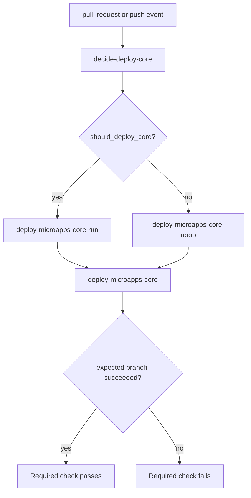
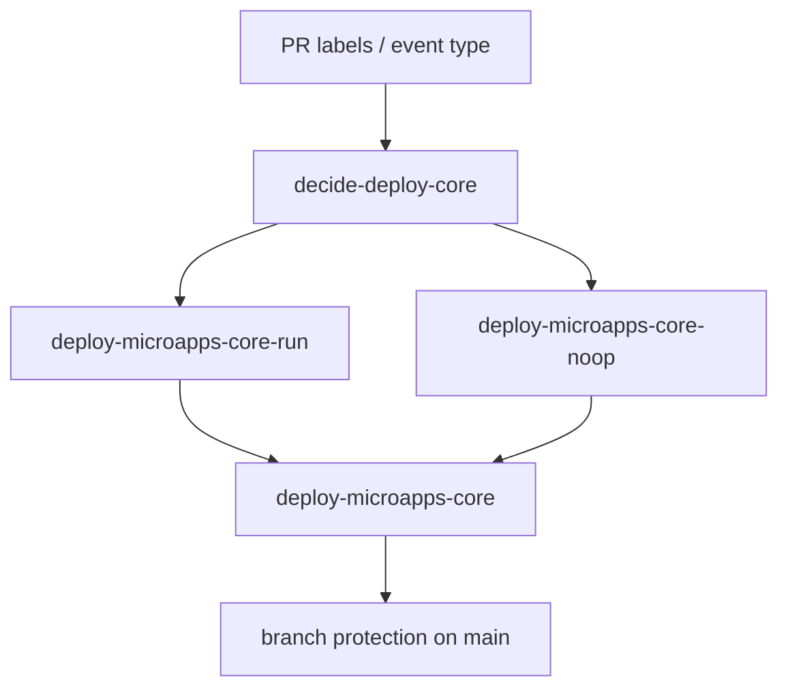

# fix: Make required preview deploy check conditional

## Overview

Refactor the PR preview deploy portion of `CI` so the required `deploy-microapps-core` check always reports a result on pull requests, while only performing the real AWS deploy when `DEPLOY-CORE` is present. The follow-up should preserve the new label-driven preview policy, avoid a step-level `if:` explosion across the existing deploy sequence, and keep the failure semantics strict when a deploy was actually requested.

## Problem Frame

The preview deploy classifier rollout made PR deploys label-driven, but `main` branch protection still requires a check named `deploy-microapps-core`. The current workflow shape does not always emit that exact required check context, so unlabeled PRs can end up with GitHub showing `Expected — Waiting for status to be reported` even though skipping the deploy is the intended behavior. At the same time, when `DEPLOY-CORE` is present, the repository still needs a strict guarantee that the deploy really ran and really passed before the PR can merge.

This is a follow-up workflow-architecture fix inside the same preview-deploy feature area (see origin: `docs/brainstorms/2026-04-04-preview-deploy-auto-labeling-requirements.md` and follow-up context in `docs/plans/2026-04-04-002-feat-preview-deploy-scope-classifier-plan.md`). The change is about how the required check is surfaced to GitHub branch protection, not about changing the label model or the underlying deploy mechanics.

## Requirements Trace

- R1. Unlabeled PRs must continue to avoid AWS preview deploy work by default.
- R2. The required PR check `deploy-microapps-core` must always report a terminal status on PRs rather than remaining `Expected`.
- R3. If `DEPLOY-CORE` is present, the real `microapps-core` preview deploy must run and its failure must fail the required check.
- R4. If `DEPLOY-CORE` is absent, the required check must succeed through an explicit no-op path rather than by omitting the check entirely.
- R5. The workflow should avoid per-step conditional duplication across the existing deploy sequence.
- R6. Pushes to `main` must retain current deploy behavior for `microapps-core`.
- R7. Optional preview environments (`DEPLOY-BASIC`, `DEPLOY-BASIC-PREFIX`) must remain non-required in this phase.
- R8. Same-repo transient deployment statuses should only be published when a real preview deploy ran.

## Scope Boundaries

- This plan does not redesign the PR scope classifier or change the current deploy label taxonomy.
- This plan does not make `microapps-basic` or `microapps-basic-prefix` required branch-protection checks.
- This plan does not change cleanup semantics on PR close beyond what was already implemented.
- This plan does not require a repository branch-protection change if the exact required check name `deploy-microapps-core` can be preserved.
- This plan does not introduce reusable workflows unless implementation proves the single-workflow approach is materially worse than expected.

## Context & Research

### Relevant Code and Patterns

- `.github/workflows/ci.yml` currently runs `build`, `test`, `build-jsii`, `deploy`, and `Tarball Population` inside a single workflow and already passes build-derived outputs between jobs.
- `.github/workflows/ci.yml` contains the full `microapps-core` preview deploy sequence inline today, including CDK deploy, publish/test smoke checks, child-account setup, integration tests, and transient deployment-status publishing.
- `.github/workflows/ci.yml` already uses `actions/github-script@v8` to publish commit statuses and deployment statuses, so GitHub-status side effects inside the workflow are an established pattern.
- `packages/cdk/bin/cdk.ts` remains the source of truth for preview environment names and stack conventions.
- `docs/plans/2026-04-04-002-feat-preview-deploy-scope-classifier-plan.md` already established that label changes retrigger PR CI and that `DEPLOY-CORE` is the main preview gate.

### Institutional Learnings

- No relevant `docs/solutions/` entries were present for required-check orchestration or GitHub Actions branch-protection wrappers in this worktree.

### External References

- GitHub documents that if a workflow is skipped due to path or branch filtering, required checks remain pending, but if a job is skipped due to a conditional, it reports success. That distinction is the root of why the required deploy check needs an always-created job surface inside the workflow rather than a missing workflow context. [GitHub Docs](https://docs.github.com/en/pull-requests/collaborating-with-pull-requests/collaborating-on-repositories-with-code-quality-features/troubleshooting-required-status-checks?apiVersion=2022-11-28)
- GitHub also documents that required checks on a job with dependencies should use `always()` together with `needs`, which directly supports a final “required check” job that evaluates whether the run or no-op branch completed correctly. [GitHub Docs](https://docs.github.com/en/pull-requests/collaborating-with-pull-requests/collaborating-on-repositories-with-code-quality-features/troubleshooting-required-status-checks?apiVersion=2022-11-28)
- The `needs.<job_id>.result` context exposes `success`, `failure`, `cancelled`, and `skipped`, which makes a final aggregator job able to distinguish the deploy branch from the no-op branch without step-level duplication. [GitHub Docs](https://docs.github.com/en/actions/reference/workflows-and-actions/contexts)
- GitHub branch protection accepts required checks in `successful`, `skipped`, or `neutral` states, but the required check must actually exist and report. [GitHub Docs](https://docs.github.com/articles/about-required-reviews-for-pull-requests)

## Key Technical Decisions

- Replace the current required `microapps-core` preview surface with a fixed-name GitHub Actions job `deploy-microapps-core`.
  Rationale: `main` branch protection already requires that exact context, and reusing the exact name avoids a separate branch-protection update while moving the semantics fully into the workflow DAG.
- Use a single-workflow diamond shape: decision job -> real deploy job or no-op job -> final required-check job.
  Rationale: this preserves strict success/failure semantics for real deploys, avoids per-step `if:` duplication across the existing deploy sequence, and fits GitHub’s documented `needs`/`always()` behavior for required checks.
- Keep the heavy deploy sequence in a dedicated `deploy-microapps-core-run` job rather than gating dozens of steps inside one giant job.
  Rationale: the current deploy path is already long and multi-stage; wrapping it in a single condition at the job level is much easier to reason about than guarding every step individually.
- Make the no-op path explicit with a dedicated `deploy-microapps-core-noop` job.
  Rationale: the required check should pass because the workflow intentionally decided “no deploy needed,” not because the required context disappeared.
- Keep `microapps-basic` and `microapps-basic-prefix` outside the required-check contract in this phase.
  Rationale: branch protection currently only requires `deploy-microapps-core`, so the follow-up should solve the failing/pending required-check problem without expanding scope to the extra environments.
- Publish transient PR deployment status only from the real deploy branch.
  Rationale: a no-op path should satisfy branch protection, not create the illusion that a preview environment exists.

## Open Questions

### Resolved During Planning

- Should the fix rely on a separate custom commit status context instead of a GitHub Actions job?
  Resolution: no. Use a fixed-name GitHub Actions job `deploy-microapps-core` as the required surface so branch protection is satisfied by workflow-native behavior rather than by additional status-publishing glue.
- Does the single-workflow diamond shape work with GitHub Actions dependency semantics?
  Resolution: yes. GitHub documents `needs.<job>.result` and recommends `always()` for required checks that depend on other jobs, which fits the decision -> run/no-op -> final-check model.
- Should the deploy/no-op decision be moved into step-level `if:` conditions inside the existing deploy job?
  Resolution: no. The job graph should own the branching so the heavy deploy steps stay concentrated in the real deploy job.

### Deferred to Implementation

- Whether the `deploy-microapps-core-run` job should be created by extracting the current matrix-based core path first or by splitting the existing deploy job in place.
  Why deferred: the better edit sequence depends on how much duplication remains after factoring `microapps-core` out of the current matrix.
- Whether the remaining optional preview jobs should keep a matrix shape or become two explicit jobs after `microapps-core` is separated.
  Why deferred: both shapes are viable; the implementer should pick the one that leaves the workflow clearest after the core required-check refactor.
- Whether maintainers want a follow-up branch-protection cleanup to remove any stale historical required contexts once the workflow is stable.
  Why deferred: the current follow-up should first prove the required check name is emitted correctly without repository settings churn.

## High-Level Technical Design

> *This illustrates the intended approach and is directional guidance for review, not implementation specification. The implementing agent should treat it as context, not code to reproduce.*

The key property is that `deploy-microapps-core` always exists as the required check surface, while only one of the upstream branches is expected to do real work.

## Implementation Units

- [x] **Unit 1: Introduce an explicit core deploy decision job**

**Goal:** Compute whether the current workflow run should perform the `microapps-core` preview deploy and expose that decision as workflow outputs usable by later jobs.

**Requirements:** R1, R2, R4, R6

**Dependencies:** Existing PR label model from `docs/plans/2026-04-04-002-feat-preview-deploy-scope-classifier-plan.md`

**Files:**
- Modify: `.github/workflows/ci.yml`

**Approach:**
- Add a dedicated decision job (for example `decide-deploy-core`) that runs early in the workflow and emits at least `should_deploy_core`.
- Treat pushes to `main` as `true`.
- Treat pull requests with `DEPLOY-CORE` as `true`.
- Treat unlabeled pull requests as `false`.
- Optionally emit a human-readable reason output if that improves later workflow summaries or debugging.
- Keep the decision self-contained and side-effect-free so it can be safely reused by both the real deploy path and the no-op path.

**Patterns to follow:**
- Existing job outputs in `.github/workflows/ci.yml`
- GitHub Actions `needs.<job>.outputs` usage patterns already present in `build`

**Test scenarios:**
- Happy path: a push-to-`main` event yields `should_deploy_core=true`.
- Happy path: a pull request labeled `DEPLOY-CORE` yields `should_deploy_core=true`.
- Happy path: an unlabeled pull request yields `should_deploy_core=false`.
- Edge case: a pull request labeled only `DEPLOY-BASIC` or `DEPLOY-BASIC-PREFIX` still yields `should_deploy_core=false`.
- Integration: downstream jobs can read the decision output without re-evaluating label logic independently.

**Verification:**
- Workflow consumers can branch solely from the decision job output rather than duplicating label expressions across jobs.

- [x] **Unit 2: Split the core preview path into real deploy and no-op branches**

**Goal:** Replace the current matrix-owned `microapps-core` PR deploy behavior with explicit `run` and `noop` jobs so the heavy deploy path only executes when requested.

**Requirements:** R1, R3, R4, R5, R6, R8

**Dependencies:** Unit 1

**Files:**
- Modify: `.github/workflows/ci.yml`

**Approach:**
- Extract the current `microapps-core` deploy sequence from the generic deploy matrix into a dedicated job such as `deploy-microapps-core-run`.
- Gate that job with `if: needs.decide-deploy-core.outputs.should_deploy_core == 'true'`.
- Create a lightweight companion job such as `deploy-microapps-core-noop` gated by the inverse condition.
- The no-op branch should perform no AWS work and simply record that no deploy was required.
- Keep transient PR deployment-status publishing, preview URL status emission, and any AWS side effects inside the real deploy branch only.
- Preserve push-to-`main` semantics by having the decision job drive the same real deploy branch on push events.
- After separating `microapps-core`, leave `microapps-basic` and `microapps-basic-prefix` as optional, non-required behavior-bearing jobs or matrix rows.

**Patterns to follow:**
- Existing `build` -> `test` -> `deploy` job dependency flow in `.github/workflows/ci.yml`
- Existing same-repo transient deployment-status publishing in `.github/workflows/ci.yml`

**Test scenarios:**
- Happy path: an unlabeled PR runs the no-op branch and does not configure AWS credentials, deploy CDK, or publish transient preview deployment status.
- Happy path: a `DEPLOY-CORE` PR runs the real deploy branch and performs the current core preview deploy sequence.
- Happy path: a push to `main` still runs the real core deploy branch.
- Edge case: a PR labeled only for optional preview environments does not accidentally trigger the core deploy branch.
- Error path: a failure in the real core deploy branch causes that branch to end in failure and prevents the workflow from falsely reporting a passing core deploy.
- Integration: preview deployment-status publishing occurs only when the real deploy branch ran.

**Verification:**
- The core preview sequence is isolated behind one job-level condition rather than repeated step-level conditions.
- Unlabeled PR runs show a successful no-op branch and no real core deploy activity.

- [x] **Unit 3: Add the final required-check aggregator job**

**Goal:** Emit a stable required check named `deploy-microapps-core` that succeeds only when the expected branch (`run` or `noop`) completed correctly.

**Requirements:** R2, R3, R4, R5

**Dependencies:** Unit 2

**Files:**
- Modify: `.github/workflows/ci.yml`

**Approach:**
- Add a final job named exactly `deploy-microapps-core`.
- Give it `needs` on the decision job, the real deploy branch, and the no-op branch.
- Use `if: always()` so GitHub still runs the final job even when the real deploy branch fails or the no-op branch is skipped.
- In the final job, inspect `needs.<job>.result` and fail unless:
  - `should_deploy_core=true` and the real deploy branch succeeded, or
  - `should_deploy_core=false` and the no-op branch succeeded.
- Treat impossible states as failures, for example both branches skipped, both branches succeeded, or the wrong branch succeeded for the decision taken.
- Reuse the exact required check name `deploy-microapps-core` so existing branch protection remains satisfied without a settings migration.

**Patterns to follow:**
- GitHub Actions `needs` context behavior documented for dependent jobs
- Existing branch-protection-required check name observed on `main`

**Test scenarios:**
- Happy path: unlabeled PR -> `deploy-microapps-core-noop` succeeds -> final `deploy-microapps-core` succeeds.
- Happy path: labeled PR -> `deploy-microapps-core-run` succeeds -> final `deploy-microapps-core` succeeds.
- Error path: labeled PR -> `deploy-microapps-core-run` fails -> final `deploy-microapps-core` fails.
- Error path: the workflow reaches an impossible branch/result combination -> final `deploy-microapps-core` fails loudly.
- Integration: GitHub branch protection sees `deploy-microapps-core` as a completed required check instead of leaving it in `Expected`.

**Verification:**
- The PR merge box shows `deploy-microapps-core` as passed for unlabeled PRs and as failed when a requested core deploy fails.

- [x] **Unit 4: Document the required-check semantics for maintainers**

**Goal:** Explain why the required deploy check can pass without running a deploy and what that means operationally.

**Requirements:** R2, R4, R7

**Dependencies:** Unit 3

**Files:**
- Modify: `CONTRIBUTING.md`

**Approach:**
- Add a short maintainer-facing note near the preview label documentation describing the required `deploy-microapps-core` check behavior.
- Explain that the check now means “core deploy decision was handled correctly,” not “a deploy always ran.”
- Clarify that `DEPLOY-CORE` still upgrades the check from a no-op success path to a real deploy path whose failure blocks merging.

**Patterns to follow:**
- Existing preview-label guidance in `CONTRIBUTING.md`

**Test scenarios:**
- Test expectation: none -- documentation-only change. Verification is reviewer comprehension and consistency with implemented workflow behavior.

**Verification:**
- A maintainer reading `CONTRIBUTING.md` can explain why unlabeled PRs show a passing required core deploy check and why labeled PRs still block on a real deploy failure.

## System-Wide Impact

- **Interaction graph:** PR labels feed the decision job; the decision job selects either the real core deploy branch or the no-op branch; the final required job evaluates branch results and becomes the branch-protection surface.
- **Error propagation:** the final required job must use `always()` and explicitly inspect upstream results, otherwise a failed deploy branch could skip the required check and accidentally weaken branch protection.
- **State lifecycle risks:** the no-op branch must not publish deployment statuses or otherwise imply that a preview environment exists when it does not.
- **API surface parity:** branch protection currently expects `deploy-microapps-core`; the workflow should preserve that exact external contract rather than introducing a new required-check name unless repository settings are updated in lockstep.
- **Integration coverage:** the critical cross-layer path is label state -> decision output -> chosen branch result -> final required job result -> branch protection merge gate.
- **Unchanged invariants:** `build` remains required; push-to-`main` still performs the real core deploy; optional preview environments remain label-driven and non-required in this phase.

## Risks & Dependencies

| Risk | Mitigation |
|------|------------|
| Final required job is skipped instead of evaluating upstream results | Use `if: always()` with explicit `needs` inspection and treat unexpected states as failure |
| Required check name no longer matches branch protection | Preserve the exact job name `deploy-microapps-core`, or coordinate any rename with branch-protection updates |
| Real deploy failures are accidentally masked by the no-op path | Make the final job decision-dependent and fail unless the expected branch succeeded |
| Refactoring the core path out of the matrix introduces drift from the existing deploy sequence | Start by moving the current `microapps-core` sequence intact, then simplify only after parity is established |
| Optional extra preview jobs still create confusing skipped surfaces | Keep them non-required and consider a follow-up naming cleanup only if they remain operationally confusing after the core fix lands |

## Documentation / Operational Notes

- The PR merge box should show `deploy-microapps-core` as a real completed check on every PR after this change.
- This plan intentionally aligns workflow structure to the existing branch-protection contract rather than asking maintainers to immediately change repository settings.
- If merge queue is enabled later for this repository, the required-check workflow should be reviewed for `merge_group` coverage so the required check still reports in queued merges.

## Sources & References

- **Origin document:** `docs/brainstorms/2026-04-04-preview-deploy-auto-labeling-requirements.md`
- Related plan: `docs/plans/2026-04-04-002-feat-preview-deploy-scope-classifier-plan.md`
- Related code: `.github/workflows/ci.yml`
- Related code: `packages/cdk/bin/cdk.ts`
- External docs: [Troubleshooting required status checks](https://docs.github.com/en/pull-requests/collaborating-with-pull-requests/collaborating-on-repositories-with-code-quality-features/troubleshooting-required-status-checks?apiVersion=2022-11-28)
- External docs: [Contexts reference (`needs.<job_id>.result`)](https://docs.github.com/en/actions/reference/workflows-and-actions/contexts)
- External docs: [About protected branches](https://docs.github.com/articles/about-required-reviews-for-pull-requests)
